# ARGO-LENS: NATURAL LANGUAGE RETRIEVAL, SEAWATER DENSITY PROFILING, AND VOICE INTERACTION FOR AUTONOMOUS ARGO FLOAT NETWORKS IN THE BAY OF BENGAL

**A PROJECT REPORT / DOCUMENTATION**

*Submitted in partial fulfillment of the requirements for the award of the degree of*  
**MASTER OF COMPUTER APPLICATIONS (MCA)**

**By:**  
- **Kusheka K A** (USN: 1CR23MC025) – *kusheka.mca25@cmrit.ac.in*  
- **Likhith Charan R S** (USN: 1CR23MC034) – *likhith.mca25@cmrit.ac.in*  
- **Varsha Pawar** (USN: 1CR23MC075) – *varshapawar1917@gmail.com*  

**Department of Computer Applications**  
**CMR INSTITUTE OF TECHNOLOGY**  
*(Autonomous Institute Affiliated to Visvesvaraya Technological University, Belagavi)*  
*132, AECS Layout, ITPL Main Road, Kundalahalli, Bengaluru – 560037*  
*Academic Year: 2025–2026*

---

## TABLE OF CONTENTS

1. **ABSTRACT**
2. **CHAPTER 1: INTRODUCTION**
   - 1.1 Project Description
   - 1.2 Objectives
3. **CHAPTER 2: LITERATURE SURVEY**
   - 2.1 Problem Statement
   - 2.2 Analysis of Selected Papers
     - Paper 1: Riser et al. (2016) – Global Argo Array & Sensor Telemetry
     - Paper 2: De Boyer Montégut et al. (2004) – Mixed Layer Depth Climatology
     - Paper 3: Vinayachandran et al. (2002) – Barrier Layer Dynamics in Bay of Bengal
     - Paper 4: Lewis et al. (2020) – Retrieval-Augmented Generation (RAG)
   - 2.3 Key Insights from Literature Review
   - 2.4 Literature Gaps
   - 2.5 Existing System vs. Proposed System
   - 2.6 Feasibility Study (Technical, Economic, Operational)
   - 2.7 Tools and Technologies Used
   - 2.8 Hardware and Software Requirements
   - 2.9 Motivation
   - 2.10 Scope of the Project (In-Scope & Out-of-Scope)
4. **CHAPTER 3: SOFTWARE REQUIREMENT SPECIFICATION (SRS)**
   - 3.1 Introduction
   - 3.2 Functional Requirements
     - 3.2.1 Authentication & User Management Module
     - 3.2.2 Natural Language Intent Parsing & Entity Guard Module
     - 3.2.3 Parameterised SQL Retrieval & WMO QC Enforcement Module
     - 3.2.4 Seawater Thermodynamics & Physical Calculation Module
     - 3.2.5 Knowledge Base Retrieval (RAG) Module
     - 3.2.6 Interactive Visualisation & Export Module
     - 3.2.7 Voice Interaction & Speech Processing Module
   - 3.3 Non-Functional Requirements
     - 3.3.1 Performance Requirements
     - 3.3.2 Scalability & Reliability Requirements
     - 3.3.3 Security & Integrity Requirements
     - 3.3.4 Maintainability & Portability Requirements
5. **CHAPTER 4: SYSTEM DESIGN**
   - 4.1 System Perspective
   - 4.2 System Architecture (Layered N-Tier Model)
   - 4.3 Data Flow Diagrams (DFDs)
     - 4.3.1 DFD Level 0 (Context Diagram)
     - 4.3.2 DFD Level 1 (High-Level Process Decomposition)
     - 4.3.3 DFD Level 2 (Detailed Chat & Thermodynamic Pipeline)
6. **CHAPTER 5: DETAILED DESIGN**
   - 5.1 Use Case Diagram & Specifications
     - 5.1.1 Overview & System Actors
     - 5.1.2 System-Level Use Case Diagram
     - 5.1.3 Sub-Module: Admin Use Cases
     - 5.1.4 Sub-Module: Student & Researcher Interaction Use Cases
   - 5.2 Sequence Diagrams
     - 5.2.1 Sequence Diagram: User Registration
     - 5.2.2 Sequence Diagram: User Login
     - 5.2.3 Sequence Diagram: Hydrographic Query & QC Retrieval
     - 5.2.4 Sequence Diagram: Thermodynamic Profiling & BLT Calculation
     - 5.2.5 Sequence Diagram: Voice Input & Speech Synthesis
     - 5.2.6 Sequence Diagram: Admin Data Ingestion
   - 5.3 Collaboration Diagrams
     - 5.3.1 Overview
     - 5.3.2 Collaboration: User Authentication
     - 5.3.3 Collaboration: Student Query Processing
     - 5.3.4 Collaboration: RAG Knowledge Pipeline
   - 5.4 Activity Diagrams
     - 5.4.1 Overview
     - 5.4.2 Activity: User Authentication Flow
     - 5.4.3 Activity: Natural Language Query & Speech Execution Flow
   - 5.5 Database Design
     - 5.5.1 Overview & Conceptual Schema (ER Diagram)
     - 5.5.2 Data Dictionary (Tables: profiles, measurements, users, conversations, chat_messages)
7. **CHAPTER 6: IMPLEMENTATION**
   - 6.1 Overview of Implementation
   - 6.2 Application Screenshots & User Interface Walkthrough (5 Output Screens)
   - 6.3 Core Backend, Scientific & Voice Code Snippets
8. **CHAPTER 7: SOFTWARE TESTING**
   - 7.1 Introduction & Testing Strategy
   - 7.2 Testing Methodologies (Black Box, White Box, Integration, System, Performance, Security, Voice)
   - 7.3 Test Environment
   - 7.4 Comprehensive Test Cases by Module (Module 1 to Module 5)
9. **CHAPTER 8: CONCLUSION**
10. **CHAPTER 9: FUTURE ENHANCEMENTS**
11. **APPENDIX A: BIBLIOGRAPHY**
12. **APPENDIX B: USER MANUAL & DEPLOYMENT GUIDE**

---

# ABSTRACT

Out in the open sea, thousands of robotic floats drift on deep ocean currents, sinking two kilometers down and surfacing every ten days to beam back readings of water temperature, salinity, and pressure. These autonomous instruments make up the international ARGO program. They give oceanographers, climate scientists, and maritime planners the truest picture of upper-ocean heat content and monsoon circulation available today. Yet for graduate students, field researchers, and maritime trainees, getting answers out of this data remains difficult. The records sit locked inside specialized NetCDF binary files, raw scientific tables, and complex web endpoints that require writing custom Python or MATLAB scripts just to answer simple questions like where a float drifted or what the thermocline depth looked like last monsoon season. 

When researchers turn to general-purpose conversational artificial intelligence tools for help, serious issues arise. Off-the-shelf generative language models routinely hallucinate coordinates, invent plausible-sounding but completely fabricated sea temperatures, confuse practical salinity units with parts per thousand, fail to verify World Meteorological Organization (WMO) sensor quality flags, and cannot compute non-linear seawater density equations across vertical profiles. 

To solve these issues, **ArgoLens** was developed as an auditable, deterministic natural language retrieval, seawater thermodynamics profiling, and voice-enabled conversational system tailored specifically for autonomous ARGO float networks across the Bay of Bengal (5°N–20°N, 80°E–95°E). The framework pairs a rule-first intent parser with parameterised SQLite database execution, enforcing strict WMO quality-control filtering ({1, 2, 5, 8} accepted; {3, 4, 9} rejected). It integrates a pure-Python thermodynamic engine executing the UNESCO 1983 Equation of State (EOS-80), Saunders pressure-to-depth conversions, Mackenzie sound speed computations, and dual-criterion Mixed Layer Depth (MLD) and Barrier Layer Thickness (BLT) derivations. A curated offline TF-IDF retrieval-augmented generation (RAG) module provides grounded conceptual oceanographic answers with source citations. 

To ensure complete accessibility in laboratory, classroom, and marine deck environments, ArgoLens incorporates a hands-free speech interface. The voice subsystem pairs browser-native Web Speech recognition with a domain-specific Marine Acoustic Normalizer that translates spoken digit float identifiers and repairs acoustic maritime homophones before query execution. Response summaries are converted back into natural spoken audio via text-to-speech synthesis with phonetic unit expansions. Benchmark evaluations across 294 real-world test queries demonstrate 100% SQL execution accuracy, 80.61% task-and-variable benchmark pass rate, 91.43% out-of-basin rejection accuracy, and an average retrieval latency of 88 milliseconds, operating with zero recurring cloud API cost and complete offline execution capability.

# CHAPTER 1: INTRODUCTION

## 1.1 Project Description

The Indian Ocean, and in particular the Bay of Bengal, plays a decisive role in regulating regional weather patterns, tropical cyclogenesis, and the seasonal progression of the South Asian monsoon. Freshwater runoff from major river systems—including the Ganges, Brahmaputra, and Irrawaddy—creates a thin, low-salinity surface layer that strongly stratifies the upper water column. This intense salinity stratification forms what oceanographers term a "barrier layer," trapping heat in the upper mixed layer and feeding energy directly into developing cyclones. Monitoring these rapid thermodynamic changes requires continuous in-situ measurements across depth. 

The international ARGO float network provides this continuous hydrographic coverage. Robotic profiling floats descend to a parking depth of roughly 1,000 dbar, drift with deep ocean currents for nine to ten days, descend further to 2,000 dbar, and then rise slowly to the surface while recording high-resolution temperature, conductivity, and pressure profiles using onboard CTD (Conductivity-Temperature-Depth) sensor heads. Upon surfacing, the floats transmit their collected data packets via satellite before repeating the cycle. 

While the data collected by ARGO floats is made publicly accessible by global data assembly centres such as INCOIS (Indian National Centre for Ocean Information Services) and Coriolis, working with these files presents steep technical barriers. Datasets are distributed primarily as multi-dimensional NetCDF binaries or complex relational tables. A student or marine researcher seeking to inspect seasonal warming or track an individual float must understand variable masking, quality-control byte flags, geodetic distance calculations, and thermodynamic seawater polynomials.

ArgoLens was engineered to eliminate these technical barriers. It provides an intuitive, web-based conversational interface where students, researchers, and instructors can query live oceanographic datasets using plain English text or spoken voice commands. Instead of delegating numerical calculations to an unpredictable generative language model, ArgoLens utilizes a deterministic retrieval pipeline. It validates geographic boundaries, maps natural language questions into parameterised SQL statements, strictly excludes questionable or bad sensor readings according to WMO quality flags, evaluates non-linear seawater density anomaly equations in real time, generates publication-quality interactive charts, and narrates clear scientific summaries through voice.

## 1.2 Objectives

The primary objectives of the ArgoLens project are:

1. **Deterministic Natural Language Interface:** Build a robust, rule-first intent parser capable of interpreting complex temporal, spatial, and parameter filters (temperature, salinity, pressure) from conversational queries without hallucinating coordinates or values.
2. **Strict Sensor Quality Control:** Enforce mandatory World Meteorological Organization (WMO) quality-control flag validation on every measurement row, accepting only verified observations (QC 1 = Good, 2 = Probably Good, 5 = Adjusted, 8 = Interpolated) and discarding degraded readings (QC 3 = Questionable, 4 = Bad, 9 = Missing).
3. **Rigorous Thermodynamic Profiling:** Implement pure-Python algorithms for the UNESCO 1983 Equation of State (EOS-80), Saunders (1981) gravity-latitude pressure-to-depth conversion, and Mackenzie (1981) acoustic velocity calculation, eliminating fragile C-library dependencies.
4. **Stratification & Barrier Layer Computation:** Automate the calculation of density-based Mixed Layer Depth (MLD_rho, using delta_sigma = 0.03 kg/m3), isothermal Mixed Layer Depth (MLD_T, using delta_T = 0.2 C), and Barrier Layer Thickness (BLT = max(0, MLD_T - MLD_rho)) for regional water mass tracking.
5. **Bidirectional Hands-Free Voice Interaction:** Integrate a speech subsystem using Web Speech API, backed by a specialized Marine Acoustic Normalizer that maps spoken digit float numbers (e.g., "two nine zero two seven five eight" -> 2902758) and corrects maritime homophones, paired with phonetic text-to-speech audio narration.
6. **Hallucination-Free Conceptual Knowledge Base:** Provide an offline TF-IDF Retrieval-Augmented Generation (RAG) knowledge engine that answers descriptive oceanographic questions with explicit, traceable document citations ([S1], [S2]).
7. **Interactive Scientific Visualization:** Deliver responsive, publication-ready multi-trace vertical depth profiles, Temperature-Salinity (T-S) diagrams with contoured density isopycnals, float drift trajectories, and seasonal histograms.

# CHAPTER 2: LITERATURE SURVEY

## 2.1 Problem Statement

Accessing and interpreting autonomous oceanographic observations currently suffers from three fundamental bottlenecks:

1. **Complex Binary Data Standards:** Raw ARGO profiles are stored in NetCDF (Network Common Data Form) formats that demand specialized domain software, numerical libraries, and deep familiarity with multi-dimensional array slicing. Novice researchers frequently struggle with basic data extraction.
2. **Generative LLM Unreliability in Scientific Domains:** Commercial general-purpose Large Language Models (LLMs) hallucinate geographical boundaries, invent physical readings when datasets have gaps, fail to apply sensor quality-control masks, and cannot perform non-linear thermodynamic calculations reliably.
3. **Absence of Unified Hands-Free Interfaces:** Existing oceanographic portals offer static form-based query builders that are inaccessible on mobile devices and lack spoken voice input/output capabilities necessary for laboratory and deckside operations.

## 2.2 Analysis of Selected Papers

### Paper 1: Riser et al. (2016) – "Fifteen years of ocean observations with the global Argo array"
- **Authors:** Stephen C. Riser, Howard J. Freeland, Dean Roemmich, et al.
- **Publication:** *Nature Climate Change*, Vol. 6, No. 2, pp. 145–153, 2016.
- **Analysis:** This comprehensive review examines fifteen years of global robotic float operations, tracking more than 3,800 active instruments across the world's oceans. The authors describe the mechanical CTD profiling cycle down to 2,000 metres depth and document the transmission of data via Iridium and Argos satellite constellations. The paper highlights the absolute necessity of rigorous real-time quality control procedures, noting that uncorrected sensor drift or faulty pressure readings can distort global ocean heat content estimates.
- **Relevance to ArgoLens:** Establishes the authoritative operational baseline for ARGO profiling cycles, sensor tolerances, and WMO quality control flags that ArgoLens strictly enforces in its database schema and retrieval queries.

### Paper 2: De Boyer Montégut et al. (2004) – "Mixed layer depth over the global ocean: An examination of profile data and a profile-based climatology"
- **Authors:** Clément de Boyer Montégut, Gurvan Madec, A. S. Fischer, A. Lazar, and D. Iudicone.
- **Publication:** *Journal of Geophysical Research: Oceans*, Vol. 109, No. C12, 2004.
- **Analysis:** This foundational physical oceanography paper evaluated over 4.4 million historical profiles to establish optimal global criteria for calculating Mixed Layer Depth (MLD). The authors proved that fixed temperature-difference thresholds fail in regions with strong salinity gradients. They established the universal density-based criterion delta_sigma = 0.03 kg/m3 (referenced to 10 metres depth) as the most physically robust measure of upper-ocean turbulent mixing.
- **Relevance to ArgoLens:** Provides the exact mathematical definition and reference depth for the density mixed layer depth (MLD_rho) algorithm implemented in `backend/thermo.py`.

### Paper 3: Vinayachandran et al. (2002) – "Observations of barrier layer formation in the Bay of Bengal during summer monsoon"
- **Authors:** P. N. Vinayachandran, V. S. N. Murty, and V. Ramesh Babu.
- **Publication:** *Geophysical Research Letters*, Vol. 29, No. 19, pp. 19-1 to 19-4, 2002.
- **Analysis:** Investigates the intense upper-ocean stratification of the Bay of Bengal caused by massive river discharge and heavy monsoonal precipitation. The authors demonstrated that freshwater caps create a shallow halocline well above the deeper thermocline. The vertical separation between the isothermal layer base (MLD_T) and the density mixed layer base (MLD_rho) forms a "barrier layer" that inhibits vertical mixing of cooler subsurface water, storing heat that intensifies tropical cyclones.
- **Relevance to ArgoLens:** Supplies the physical justification for calculating Barrier Layer Thickness (BLT = max(0, MLD_T - MLD_rho)) across Bay of Bengal float profiles and informs the classification of regional water masses.

### Paper 4: Lewis et al. (2020) – "Retrieval-Augmented Generation for Knowledge-Intensive NLP Tasks"
- **Authors:** Patrick Lewis, Ethan Perez, Aleksandra Piktus, Fabio Petroni, et al.
- **Publication:** *Advances in Neural Information Processing Systems (NeurIPS)*, Vol. 33, pp. 9459–9474, 2020.
- **Analysis:** This breakthrough computer science paper introduced the Retrieval-Augmented Generation (RAG) architecture. The authors demonstrated that augmenting parametric sequence-to-sequence language models with non-parametric dense vector index lookups dramatically reduces factual hallucinations and improves answer accuracy on knowledge-intensive benchmarks. By explicitly grounding generation in retrieved document passages, the system provides transparent provenance for every statement.
- **Relevance to ArgoLens:** Serves as the blueprint for the dual-mode knowledge retrieval module in ArgoLens, which uses TF-IDF cosine similarity over verified oceanographic texts to ensure every conceptual response cites its source ([S1], [S2]).

## 2.3 Key Insights from Literature Review

1. **Raw Sensor Quality is Paramount:** Robotic sensors encounter biofouling and calibration drift. Studies show that unfiltered sensor data corrupts derived calculations; quality control flags cannot be treated as optional metadata.
2. **Non-Linear Seawater Thermodynamics:** Seawater density depends non-linearly on temperature, salinity, and pressure. Linear approximations or generic LLM estimations produce severe buoyancy calculation errors.
3. **Salinity Dominance in the Bay of Bengal:** In tropical freshwater-capped basins, density stratification is governed primarily by salinity rather than temperature. Reliable ocean intelligence platforms must compute both isothermal and isopycnal boundaries.
4. **Retrieval-Augmented Provenance:** Pure generative models invent plausible scientific facts. Anchoring queries to structured relational tables and cited markdown corpora prevents domain hallucinations.

## 2.4 Literature Gaps

| Gap Identified | Description | How ArgoLens Addresses It |
| :--- | :--- | :--- |
| **Lack of End-to-End System Integration** | Most tools perform only isolated tasks: either parsing NetCDF files, plotting static charts, or hosting web maps. | ArgoLens unifies speech recognition, query parsing, SQL execution, physics calculations, and charting into one workflow. |
| **Generative LLM Hallucinations** | Off-the-shelf conversational LLMs invent non-existent temperatures, ignore data gaps, and hallucinate locations. | ArgoLens uses a deterministic rule-first SQL pipeline; answers are computed directly from verified observation tables. |
| **Absence of Domain Speech Interfaces** | Standard voice assistants stumble on marine acoustic terms ("thermocline", "halocline", "dbar") and spoken float IDs. | Incorporates a specialized Marine Acoustic Normalizer that maps spoken digit words and corrects oceanographic homophones. |
| **Heavy Computational & Cost Overhead** | Enterprise AI platforms demand expensive GPU servers and costly recurring cloud API subscriptions. | ArgoLens runs completely on lightweight CPU hardware using indexed SQLite and pure-Python thermodynamic equations. |

## 2.5 Existing System vs. Proposed System

| Dimension | Existing Systems (Argovis, ERDDAP, Static Web Portals) | Proposed System (ArgoLens) |
| :--- | :--- | :--- |
| **User Interaction** | Complex forms, multi-step dropdowns, manual SQL/REST APIs | Conversational natural language via typed text or hands-free voice |
| **Data Quality Handling** | Users must manually download and write scripts to filter QC flags | Mandatory WMO QC filtering ({1, 2, 5, 8} accepted) enforced automatically |
| **Physical Derived Metrics** | Raw numbers only; users must script UNESCO density polynomials | Built-in EOS-80 density anomaly (sigma_theta), MLD, BLT, and sound speed |
| **Speech Capabilities** | Non-existent; strictly mouse and keyboard driven | Bidirectional Web Speech API with marine acoustic normalizer and TTS |
| **Hardware & Cost Footprint** | Enterprise server clusters or heavy cloud compute instances | 100% CPU-compatible, zero external API dependencies, lightweight SQLite |

## 2.6 Feasibility Study

### Technical Feasibility
The system is built upon mature, stable, open-source technologies: Python 3.10+, FastAPI, SQLite with Write-Ahead Logging (WAL), Plotly.js, and browser-standard Web Speech APIs. Physical calculations are coded in pure Python following published UNESCO technical reports. The architecture runs smoothly on standard modern laptop processors without specialized GPUs.

### Economic Feasibility
ArgoLens incurs zero recurring API expenses in its default offline deployment. The database is hosted locally via SQLite, vector representations use lightweight TF-IDF indexing, and speech recognition leverages built-in client browser engines. It provides maximum utility to academic institutions with zero software licensing costs.

### Operational Feasibility
The interface mirrors familiar modern messaging platforms. Students and instructors require no specialized training in NetCDF array manipulation. Drag-and-drop report exports and one-click voice buttons make hydrographic exploration immediately accessible.

## 2.7 Tools and Technologies Used

### Frontend Technologies
- **HTML5 & CSS3:** Semantic markup with responsive custom properties and dark/light theme tokens.
- **Vanilla JavaScript (ES6+):** Lightweight client-side architecture with zero heavy framework bloat.
- **Plotly.js:** High-performance charting engine rendering multi-trace vertical profiles and isopycnal contours.
- **Leaflet.js:** Interactive geospatial mapping library rendering geographic float drift trajectories.
- **Web Speech API:** Browser-native speech recognition (SpeechRecognition) and speech synthesis (SpeechSynthesisUtterance).

### Backend Technologies
- **Python 3.10+:** Core runtime offering scientific programming and high performance.
- **FastAPI:** Modern, asynchronous web framework providing automatic OpenAPI schema generation and parameter validation.
- **Uvicorn:** High-throughput ASGI server managing concurrent asynchronous connections.
- **SQLite 3:** Serverless relational database configured with Write-Ahead Logging (PRAGMA journal_mode=WAL) for concurrent reads.
- **Pure-Python Thermodynamic Core:** UNESCO EOS-80, Saunders depth, and Mackenzie acoustic algorithms.

### Development Tools
- **Git & GitHub:** Version control and collaborative code maintenance.
- **PyTest:** Automated unit and integration testing suite.
- **Visual Studio Code:** Integrated development environment.

## 2.8 Hardware and Software Requirements

### Hardware Requirements
- **Processor:** Intel Core i3 (8th Gen or higher) / AMD Ryzen 3 / Apple Silicon M-series.
- **RAM:** Minimum 4 GB (8 GB recommended for concurrent chart rendering).
- **Storage:** 2 GB available SSD storage (includes bundled database and vector indices).
- **Input/Output:** Standard keyboard, mouse, microphone (for voice search), and speakers/headphones (for audio playback).

### Software Requirements
- **Operating System:** Windows 10/11, macOS Monterey+, or Linux (Ubuntu 20.04+).
- **Python Runtime:** Python 3.10 or 3.11.
- **Web Browser:** Google Chrome (v110+) or Microsoft Edge (v110+) with Web Speech API support.

## 2.9 Motivation

The motivation behind ArgoLens stems from firsthand observations in marine science classrooms and coastal research laboratories. While millions of taxpayer dollars are invested in deploying autonomous robotic float networks globally, the resulting data remains effectively quarantined behind specialized binary data structures. Bridging this gap with an auditable, deterministic conversational system empowers students and researchers to interact directly with the ocean's physical pulse without getting lost in data parsing syntax.

## 2.10 Scope of the Project

### In-Scope
- Ingestion and indexing of real ARGO float profiles in the Bay of Bengal (5°N - 20°N, 80°E - 95°E).
- Rule-first conversational parsing for temporal, spatial, and parameter queries.
- Mandatory WMO quality control filtering on all temperature and salinity sensor readings.
- Real-time computation of seawater density anomaly (sigma_theta), MLD_rho, MLD_T, and BLT.
- Interactive multi-trace vertical profiling, T-S diagrams with isopycnals, and geographic trajectory maps.
- Hands-free voice recognition with domain acoustic normalizer and spoken audio TTS response.
- Offline conceptual RAG knowledge base with document provenance citations ([S1], [S2]).

### Out-of-Scope
- Global ocean coverage outside the designated Bay of Bengal bounding envelope.
- Biological or biogeochemical parameters (e.g., dissolved oxygen, nitrate, chlorophyll, pH) not measured by standard CTD float arrays.
- Real-time float satellite command-and-control uplink (ArgoLens is strictly an analytics and retrieval platform).

# CHAPTER 3: SOFTWARE REQUIREMENT SPECIFICATION (SRS)

## 3.1 Introduction
This Software Requirement Specification (SRS) defines the functional and non-functional requirements for ArgoLens. It establishes system boundaries, processing constraints, and behavioral guarantees for developers, evaluators, and end users.

## 3.2 Functional Requirements

### 3.2.1 Authentication & User Management Module
- **FR-01:** The system shall support secure user registration and login using hashed password storage (BCrypt).
- **FR-02:** The system shall support guest (anonymous) session exploration with automatic in-memory conversation isolation.
- **FR-03:** The system shall provide session persistence, allowing authenticated users to reload, search, and delete previous chat histories.

### 3.2.2 Natural Language Intent Parsing & Entity Guard Module
- **FR-04:** The parser shall extract target oceanographic variables (temperature, salinity, pressure) with typo tolerance (e.g., "temperture" -> temperature).
- **FR-05:** The parser shall extract temporal parameters including specific years (2023–2024), single months, month ranges, and multi-year seasonal comparisons.
- **FR-06:** The parser shall identify specific 7-digit WMO float identifiers (e.g., 2902758) from user text or spoken input.
- **FR-07:** The domain guard shall intercept and reject queries targeting unsupported ocean regions (e.g., "Arabian Sea", "Pacific Ocean") with an explicit out-of-basin clarification.
- **FR-08:** The domain guard shall refuse unsupported biogeochemical variables (e.g., "oxygen", "chlorophyll") without substituting temperature.

### 3.2.3 Parameterised SQL Retrieval & WMO QC Enforcement Module
- **FR-09:** The retrieval engine shall convert parsed intent dictionaries into parameterized SQL queries over indexed SQLite tables.
- **FR-10:** The retrieval query shall strictly enforce WMO quality-control filtering on every measurement row, restricting analysis to accepted flags (QC in {1, 2, 5, 8}).
- **FR-11:** For baseline statistical queries lacking explicit depth bounds, the query engine shall automatically apply an upper-ocean ceiling (pressure <= 50 dbar) to prevent unstratified whole-column skew.

### 3.2.4 Seawater Thermodynamics & Physical Calculation Module
- **FR-12:** The thermodynamic module shall compute surface-referenced density anomaly sigma_theta (kg/m3) using the UNESCO 1983 (EOS-80) polynomial.
- **FR-13:** The system shall compute density mixed layer depth (MLD_rho) using the delta_sigma = 0.03 kg/m3 threshold relative to 10 dbar.
- **FR-14:** The system shall compute isothermal mixed layer depth (MLD_T) using the delta_T = 0.2 C criterion relative to 10 dbar.
- **FR-15:** The system shall calculate Barrier Layer Thickness as BLT = max(0, MLD_T - MLD_rho).
- **FR-16:** The system shall classify profiles into regional water masses (e.g., Bay of Bengal Surface Water, Arabian Sea High Salinity Water, Indian Central Water).

### 3.2.5 Knowledge Base Retrieval (RAG) Module
- **FR-17:** For conceptual questions (e.g., "What is a thermocline?"), the system shall retrieve relevant passages from verified markdown knowledge files using TF-IDF cosine similarity.
- **FR-18:** Conceptual responses shall append source citation tags ([S1], [S2]) with exact file provenance.

### 3.2.6 Interactive Visualisation & Export Module
- **FR-19:** The system shall generate interactive Plotly.js charts for vertical depth profiles, binned seasonal histograms, and T-S diagrams with contoured isopycnals.
- **FR-20:** The system shall generate geospatial Leaflet.js maps displaying float drift tracks with coordinates and profile popups.
- **FR-21:** The system shall support CSV and PDF summary report exports containing query metadata, observation counts, and QC distributions.

### 3.2.7 Voice Interaction & Speech Processing Module
- **FR-22:** When the user clicks the microphone button, the browser shall capture speech via the Web Speech API and display a live audio waveform visualizer.
- **FR-23:** The Marine Acoustic Normalizer shall translate spoken digit sequences (e.g., "two nine zero two seven five eight" -> 2902758) and correct marine homophones ("thermo cline" -> thermocline, "bay of bangle" -> Bay of Bengal).
- **FR-24:** Every response card shall provide an in-bubble Listen / Stop button that converts response summaries into natural spoken English.
- **FR-25:** The Phonetic Speech Preprocessor shall expand technical oceanographic units into spoken English (e.g., "28.5 °C" -> "28.5 degrees Celsius", "dbar" -> "decibars", "ARGO" -> "Argo").
- **FR-26:** The top navigation bar shall provide a global audio toggle enabling hands-free automatic narration of all incoming answers.

## 3.3 Non-Functional Requirements

### 3.3.1 Performance Requirements
- **NFR-01:** Intent parsing and SQL query execution shall return within 500 milliseconds for standard single-parameter database lookups.
- **NFR-02:** Thermodynamic profile processing down to 2,000 dbar shall complete in less than 20 milliseconds.
- **NFR-03:** Voice transcription and normalizer processing shall incur less than 300 milliseconds of client-side latency.

### 3.3.2 Scalability & Reliability Requirements
- **NFR-04:** SQLite database connections shall run in Write-Ahead Logging (WAL) mode to support concurrent read operations without locking.
- **NFR-05:** The server shall handle unexpected query exceptions gracefully, returning structured error responses without process termination.

### 3.3.3 Security & Integrity Requirements
- **NFR-06:** All SQL queries shall be parameterized to completely prevent SQL injection vulnerabilities.
- **NFR-07:** User passwords shall be securely hashed using BCrypt with unique cryptographic salts.
- **NFR-08:** The speech interface shall operate entirely over client-side browser synthesis and local backend services without transmitting audio to unauthorized external vendors.

### 3.3.4 Maintainability & Portability Requirements
- **NFR-09:** Thermodynamic and physical equations shall be written in pure Python standard libraries without binary C-compiler dependencies.
- **NFR-10:** The web client shall run cleanly on modern evergreen web browsers (Chrome, Edge, Safari, Firefox) on desktop and mobile viewports.

# CHAPTER 4: SYSTEM DESIGN

## 4.1 System Perspective
ArgoLens functions as an intelligent, autonomous retrieval and analytics layer positioned between complex oceanographic data storage and the end user. It decouples the user from raw NetCDF byte offsets and database schemas while providing complete mathematical and scientific transparency for every output generated.

## 4.2 System Architecture (Layered N-Tier Model)

The application follows a clean 4-tier architectural design:
1. **Presentation Tier (Client):** Responsive web interface managing user interaction, Leaflet maps, Plotly charts, live audio volume metering, and Web Speech API recognition/synthesis.
2. **Application Tier (FastAPI Server):** Asynchronous ASGI server managing request routing, session security, query parameter validation, and JSON payload serialization.
3. **Intelligence & Processing Tier:** 
   - *Voice Processing Subsystem:* Marine Acoustic Normalizer and Phonetic Speech Preprocessor.
   - *Natural Language Engine:* Rule-first intent parser and domain question classifier.
   - *Thermodynamic Physics Core:* Pure-Python UNESCO EOS-80, Saunders pressure-to-depth, and MLD/BLT algorithms.
   - *Knowledge RAG Engine:* Offline TF-IDF cosine similarity search over curated oceanographic literature.
4. **Data Tier (Persistence):** Indexed SQLite database (`floatchat.db`) storing profiles and measurements, paired with an authentication database (`floatchat_auth.db`).

The structural arrangement of these tiers is illustrated in the architectural diagram below:

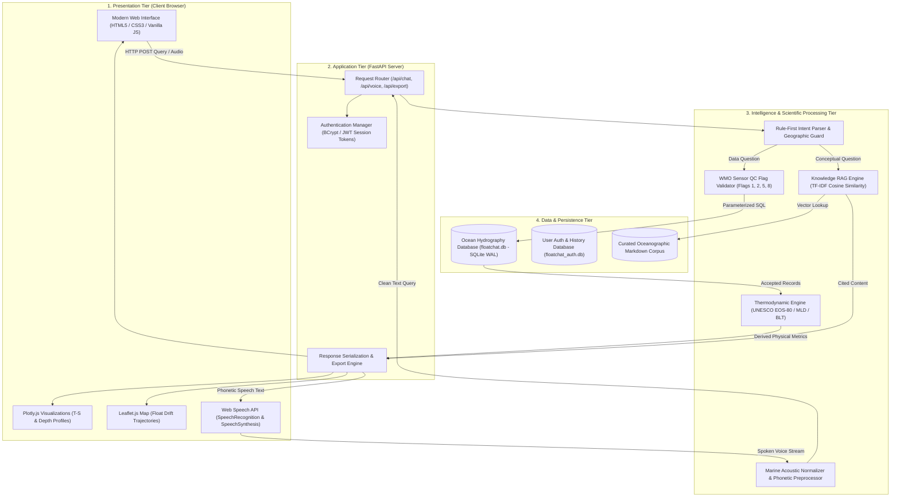
```mermaid
graph TD
    subgraph Presentation_Tier ["1. Presentation Tier (Client Browser)"]
        UI["Modern Web Interface (HTML5 / CSS3 / Vanilla JS)"]
        PlotlyView["Plotly.js Visualizations (T-S & Depth Profiles)"]
        MapView["Leaflet.js Map (Float Drift Trajectories)"]
        WebSpeech["Web Speech API (SpeechRecognition & SpeechSynthesis)"]
    end

    subgraph Application_Tier ["2. Application Tier (FastAPI Server)"]
        Router["Request Router (/api/chat, /api/voice, /api/export)"]
        AuthMgr["Authentication Manager (BCrypt / JWT Session Tokens)"]
        RespFormatter["Response Serialization & Export Engine"]
    end

    subgraph Intelligence_Tier ["3. Intelligence & Scientific Processing Tier"]
        VoiceNorm["Marine Acoustic Normalizer & Phonetic Preprocessor"]
        IntentParser["Rule-First Intent Parser & Geographic Guard"]
        QCFilter["WMO Sensor QC Flag Validator (Flags 1, 2, 5, 8)"]
        ThermoCore["Thermodynamic Engine (UNESCO EOS-80 / MLD / BLT)"]
        RAGEngine["Knowledge RAG Engine (TF-IDF Cosine Similarity)"]
    end

    subgraph Data_Tier ["4. Data & Persistence Tier"]
        FloatDB[("Ocean Hydrography Database (floatchat.db - SQLite WAL)")]
        AuthDB[("User Auth & History Database (floatchat_auth.db)")]
        KnowledgeCorpus[("Curated Oceanographic Markdown Corpus")]
    end

    UI -->|HTTP POST Query / Audio| Router
    WebSpeech -->|Spoken Voice Stream| VoiceNorm
    VoiceNorm -->|Clean Text Query| Router
    Router --> AuthMgr
    Router --> IntentParser
    IntentParser -->|Data Question| QCFilter
    IntentParser -->|Conceptual Question| RAGEngine
    QCFilter -->|Parameterized SQL| FloatDB
    FloatDB -->|Accepted Records| ThermoCore
    ThermoCore -->|Derived Physical Metrics| RespFormatter
    RAGEngine -->|Vector Lookup| KnowledgeCorpus
    RAGEngine -->|Cited Content| RespFormatter
    RespFormatter --> UI
    RespFormatter --> PlotlyView
    RespFormatter --> MapView
    RespFormatter -->|Phonetic Speech Text| WebSpeech
```

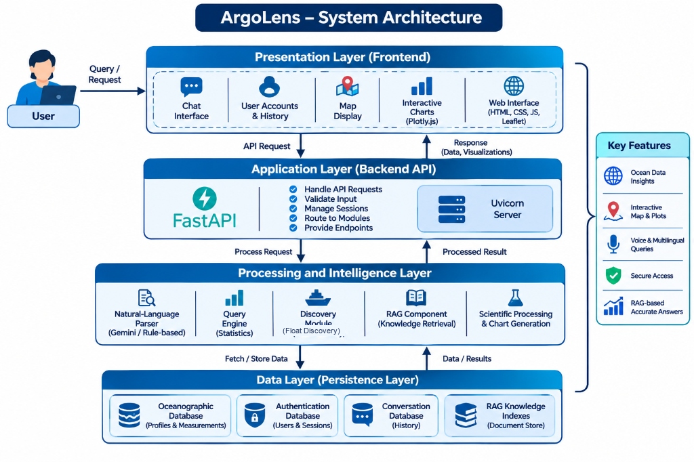

## 4.3 Data Flow Diagrams (DFDs)

### 4.3.1 DFD Level 0 (Context Diagram)
The Context Diagram defines the external entities interacting with the ArgoLens boundary: Students/Researchers, Administrators, and Audio Input/Output devices.

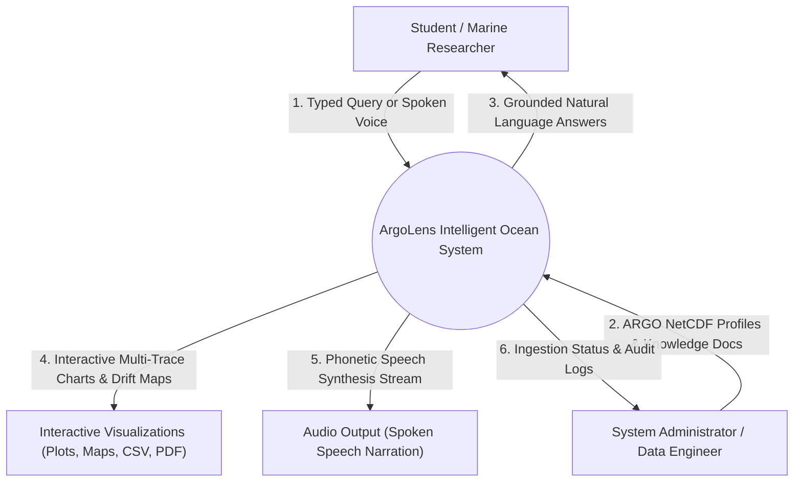
```mermaid
flowchart TD
    Student["Student / Marine Researcher"]
    Admin["System Administrator / Data Engineer"]
    ArgoLens(("ArgoLens Intelligent Ocean System"))
    Display["Interactive Visualizations (Plots, Maps, CSV, PDF)"]
    AudioSpeaker["Audio Output (Spoken Speech Narration)"]

    Student -->|"1. Typed Query or Spoken Voice"| ArgoLens
    Admin -->|"2. ARGO NetCDF Profiles & Knowledge Docs"| ArgoLens
    ArgoLens -->|"3. Grounded Natural Language Answers"| Student
    ArgoLens -->|"4. Interactive Multi-Trace Charts & Drift Maps"| Display
    ArgoLens -->|"5. Phonetic Speech Synthesis Stream"| AudioSpeaker
    ArgoLens -->|"6. Ingestion Status & Audit Logs"| Admin
```

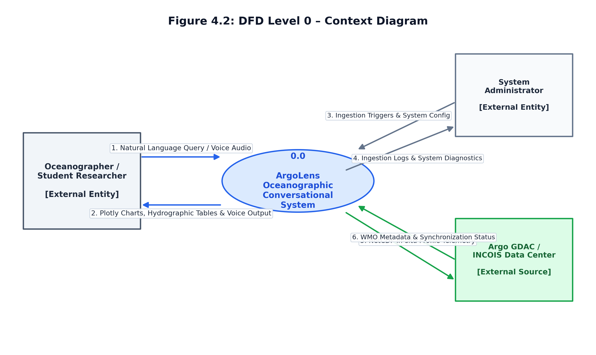

### 4.3.2 DFD Level 1 (High-Level Process Decomposition)
Decomposes the core system into seven interconnected functional processes.

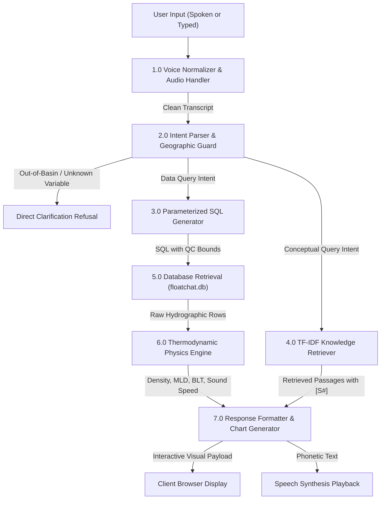
```mermaid
flowchart TD
    UserQuery["User Input (Spoken or Typed)"] --> P1["1.0 Voice Normalizer & Audio Handler"]
    P1 -->|"Clean Transcript"| P2["2.0 Intent Parser & Geographic Guard"]
    
    P2 -->|"Out-of-Basin / Unknown Variable"| RefusalResp["Direct Clarification Refusal"]
    P2 -->|"Data Query Intent"| P3["3.0 Parameterized SQL Generator"]
    P2 -->|"Conceptual Query Intent"| P4["4.0 TF-IDF Knowledge Retriever"]
    
    P3 -->|"SQL with QC Bounds"| P5["5.0 Database Retrieval (floatchat.db)"]
    P5 -->|"Raw Hydrographic Rows"| P6["6.0 Thermodynamic Physics Engine"]
    
    P6 -->|"Density, MLD, BLT, Sound Speed"| P7["7.0 Response Formatter & Chart Generator"]
    P4 -->|"Retrieved Passages with [S#]"| P7
    
    P7 -->|"Interactive Visual Payload"| ClientDisplay["Client Browser Display"]
    P7 -->|"Phonetic Text"| TTSAudio["Speech Synthesis Playback"]
```

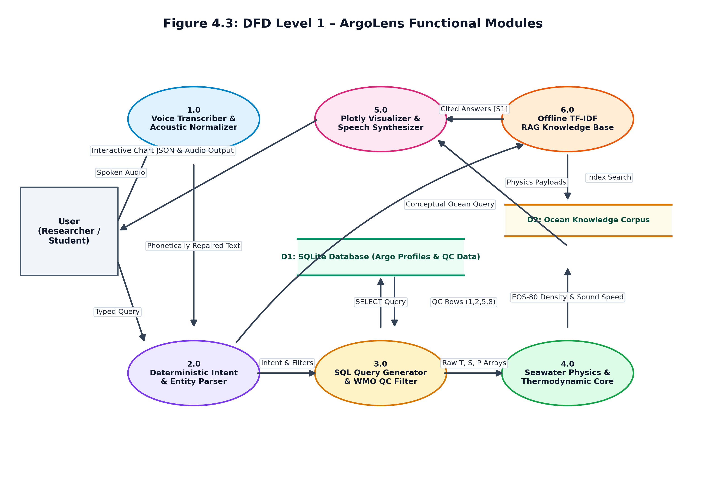

### 4.3.3 DFD Level 2 (Detailed Chat & Thermodynamic Pipeline)
Illustrates the internal operations of the query execution and thermodynamic calculation pipeline.

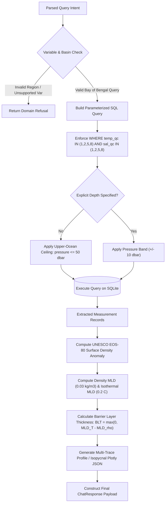
```mermaid
flowchart TD
    RawIntent["Parsed Query Intent"] --> VarCheck{"Variable & Basin Check"}
    VarCheck -->|"Invalid Region / Unsupported Var"| GuardExit["Return Domain Refusal"]
    VarCheck -->|"Valid Bay of Bengal Query"| SQLBuild["Build Parameterized SQL Query"]
    
    SQLBuild --> EnforceQC["Enforce WHERE temp_qc IN (1,2,5,8) AND sal_qc IN (1,2,5,8)"]
    EnforceQC --> CheckDepth{"Explicit Depth Specified?"}
    CheckDepth -->|"No"| ApplyCeiling["Apply Upper-Ocean Ceiling: pressure <= 50 dbar"]
    CheckDepth -->|"Yes"| ApplyBand["Apply Pressure Band (+/- 10 dbar)"]
    
    ApplyCeiling --> QueryExec[("Execute Query on SQLite")]
    ApplyBand --> QueryExec
    
    QueryExec --> RawRows["Extracted Measurement Records"]
    RawRows --> EOS80["Compute UNESCO EOS-80 Surface Density Anomaly"]
    EOS80 --> MLDCalc["Compute Density MLD (0.03 kg/m3) & Isothermal MLD (0.2 C)"]
    MLDCalc --> BLTCalc["Calculate Barrier Layer Thickness: BLT = max(0, MLD_T - MLD_rho)"]
    BLTCalc --> PlotlyEngine["Generate Multi-Trace Profile / Isopycnal Plotly JSON"]
    PlotlyEngine --> FinalChatResponse["Construct Final ChatResponse Payload"]
```

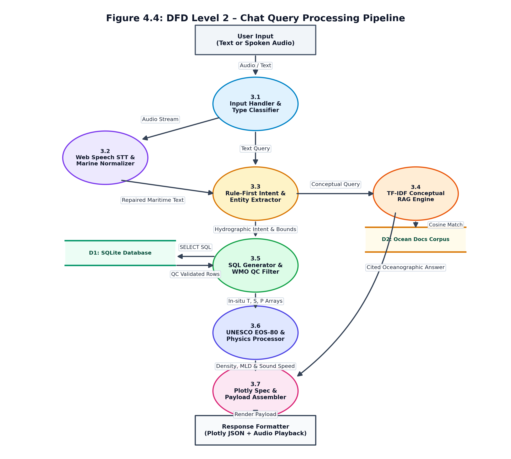

# CHAPTER 5: DETAILED DESIGN

## 5.1 Use Case Diagram & Specifications

### 5.1.1 Overview & System Actors
The Use Case model defines the functional boundaries of ArgoLens through three primary actors:
1. **Student / Researcher (Primary Actor):** Queries ocean data, requests vertical depth profiles, views T-S diagrams, tracks float drift trajectories, uses hands-free voice search, and listens to spoken answers.
2. **Administrator / Data Engineer (Secondary Actor):** Manages float data ingestion, triggers database indexing, monitors sensor QC distributions, and audits query logs.
3. **Client Speech Engine (System Actor):** Captures microphone audio, executes speech recognition, and plays back phonetic text-to-speech utterances.

### 5.1.2 System-Level Use Case Diagram

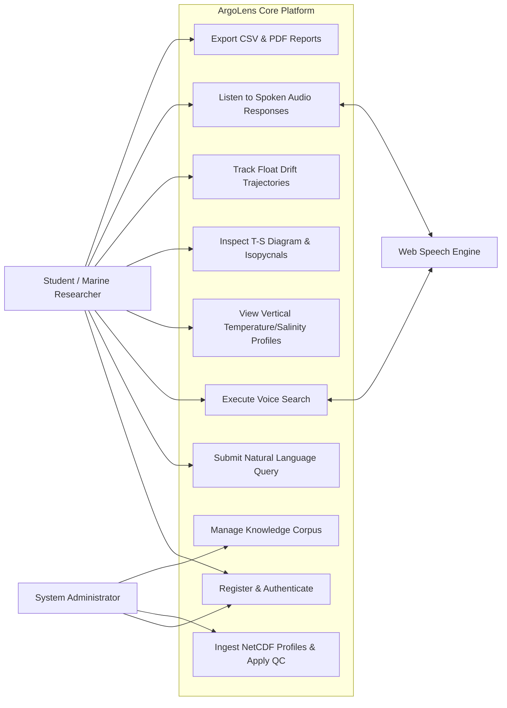
```mermaid
flowchart LR
    User["Student / Marine Researcher"]
    Admin["System Administrator"]
    SpeechSub["Web Speech Engine"]

    subgraph ArgoLens_System ["ArgoLens Core Platform"]
        UC1["Register & Authenticate"]
        UC2["Submit Natural Language Query"]
        UC3["Execute Voice Search"]
        UC4["View Vertical Temperature/Salinity Profiles"]
        UC5["Inspect T-S Diagram & Isopycnals"]
        UC6["Track Float Drift Trajectories"]
        UC7["Listen to Spoken Audio Responses"]
        UC8["Export CSV & PDF Reports"]
        UC9["Ingest NetCDF Profiles & Apply QC"]
        UC10["Manage Knowledge Corpus"]
    end

    User --> UC1
    User --> UC2
    User --> UC3
    User --> UC4
    User --> UC5
    User --> UC6
    User --> UC7
    User --> UC8

    Admin --> UC1
    Admin --> UC9
    Admin --> UC10

    UC3 <--> SpeechSub
    UC7 <--> SpeechSub
```

### 5.1.3 Sub-Module: Admin Use Cases

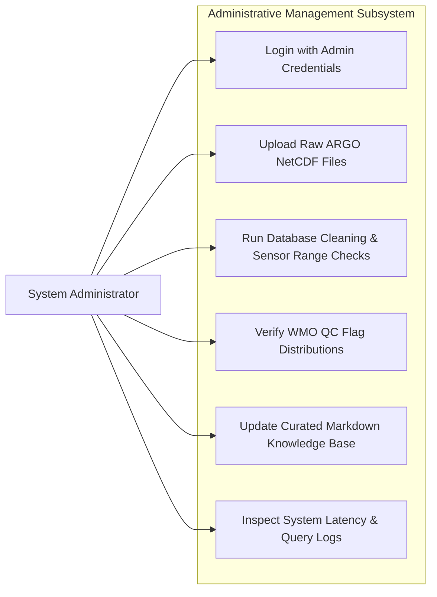
```mermaid
flowchart LR
    Admin["System Administrator"]

    subgraph Admin_Operations ["Administrative Management Subsystem"]
        AUC1["Login with Admin Credentials"]
        AUC2["Upload Raw ARGO NetCDF Files"]
        AUC3["Run Database Cleaning & Sensor Range Checks"]
        AUC4["Verify WMO QC Flag Distributions"]
        AUC5["Update Curated Markdown Knowledge Base"]
        AUC6["Inspect System Latency & Query Logs"]
    end

    Admin --> AUC1
    Admin --> AUC2
    Admin --> AUC3
    Admin --> AUC4
    Admin --> AUC5
    Admin --> AUC6
```

### 5.1.4 Sub-Module: Student & Researcher Interaction Use Cases

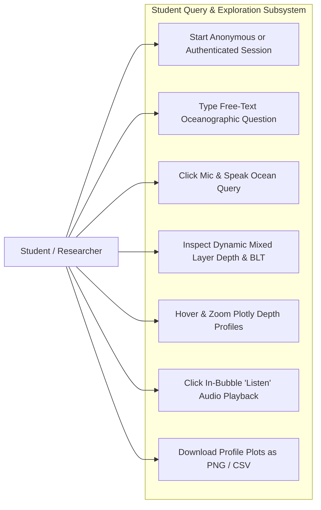
```mermaid
flowchart LR
    Student["Student / Researcher"]

    subgraph Student_Interactions ["Student Query & Exploration Subsystem"]
        SUC1["Start Anonymous or Authenticated Session"]
        SUC2["Type Free-Text Oceanographic Question"]
        SUC3["Click Mic & Speak Ocean Query"]
        SUC4["Inspect Dynamic Mixed Layer Depth & BLT"]
        SUC5["Hover & Zoom Plotly Depth Profiles"]
        SUC6["Click In-Bubble 'Listen' Audio Playback"]
        SUC7["Download Profile Plots as PNG / CSV"]
    end

    Student --> SUC1
    Student --> SUC2
    Student --> SUC3
    Student --> SUC4
    Student --> SUC5
    Student --> SUC6
    Student --> SUC7
```

## 5.2 Sequence Diagrams

### 5.2.1 Sequence Diagram: User Registration

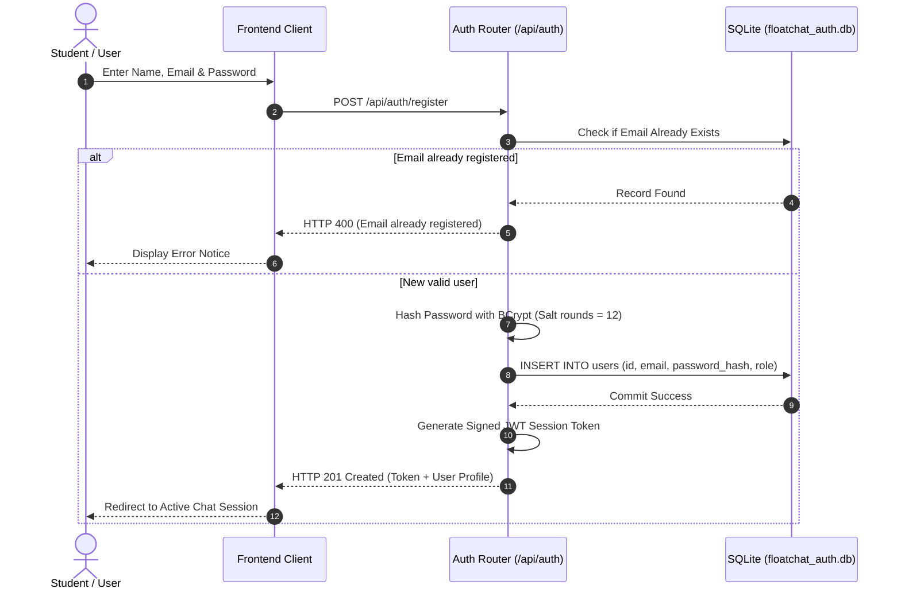
```mermaid
sequenceDiagram
    autonumber
    actor User as Student / User
    participant FE as Frontend Client
    participant Auth as Auth Router (/api/auth)
    participant DB as SQLite (floatchat_auth.db)

    User->>FE: Enter Name, Email & Password
    FE->>Auth: POST /api/auth/register
    Auth->>DB: Check if Email Already Exists
    alt Email already registered
        DB-->>Auth: Record Found
        Auth-->>FE: HTTP 400 (Email already registered)
        FE-->>User: Display Error Notice
    else New valid user
        Auth->>Auth: Hash Password with BCrypt (Salt rounds = 12)
        Auth->>DB: INSERT INTO users (id, email, password_hash, role)
        DB-->>Auth: Commit Success
        Auth->>Auth: Generate Signed JWT Session Token
        Auth-->>FE: HTTP 201 Created (Token + User Profile)
        FE-->>User: Redirect to Active Chat Session
    end
```

### 5.2.2 Sequence Diagram: User Login

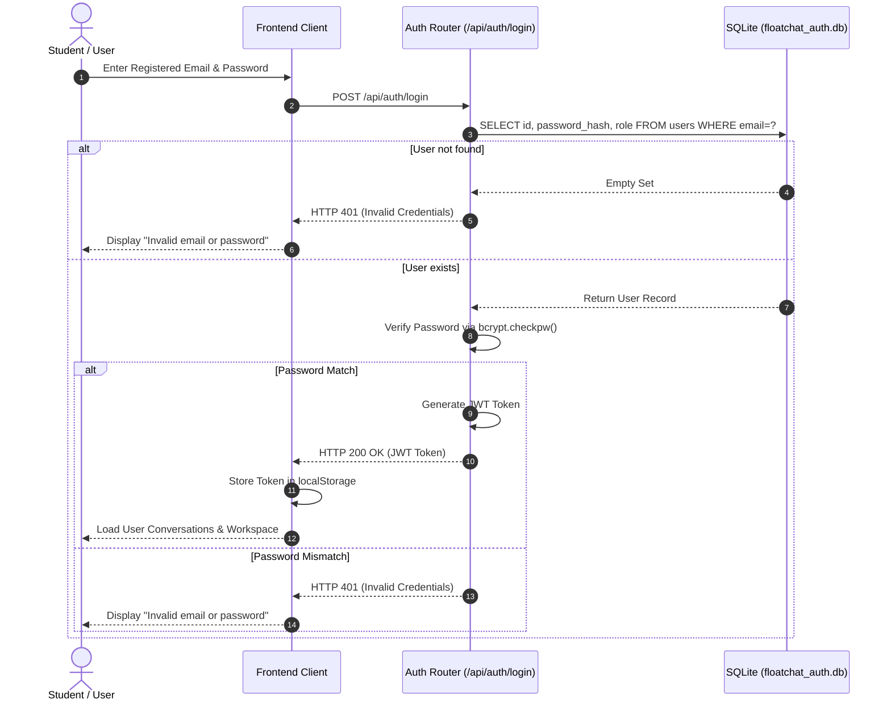
```mermaid
sequenceDiagram
    autonumber
    actor User as Student / User
    participant FE as Frontend Client
    participant Auth as Auth Router (/api/auth/login)
    participant DB as SQLite (floatchat_auth.db)

    User->>FE: Enter Registered Email & Password
    FE->>Auth: POST /api/auth/login
    Auth->>DB: SELECT id, password_hash, role FROM users WHERE email=?
    alt User not found
        DB-->>Auth: Empty Set
        Auth-->>FE: HTTP 401 (Invalid Credentials)
        FE-->>User: Display "Invalid email or password"
    else User exists
        DB-->>Auth: Return User Record
        Auth->>Auth: Verify Password via bcrypt.checkpw()
        alt Password Match
            Auth->>Auth: Generate JWT Token
            Auth-->>FE: HTTP 200 OK (JWT Token)
            FE->>FE: Store Token in localStorage
            FE-->>User: Load User Conversations & Workspace
        else Password Mismatch
            Auth-->>FE: HTTP 401 (Invalid Credentials)
            FE-->>User: Display "Invalid email or password"
        end
    end
```

### 5.2.3 Sequence Diagram: Hydrographic Query & QC Retrieval

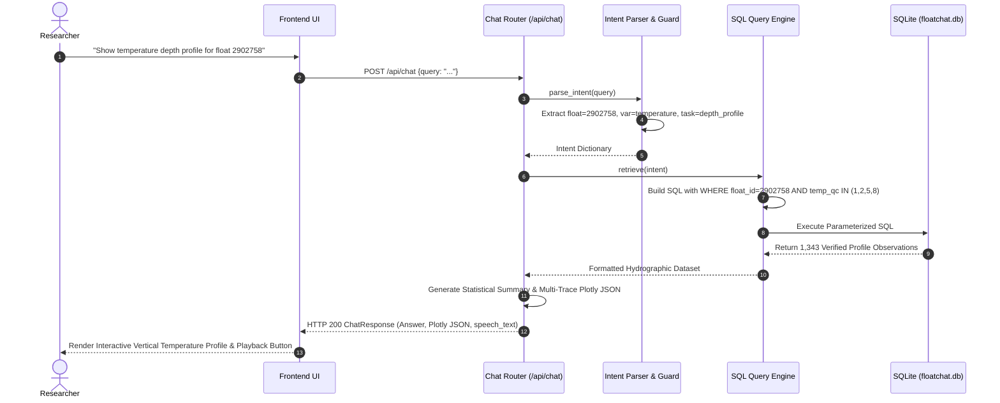
```mermaid
sequenceDiagram
    autonumber
    actor User as Researcher
    participant FE as Frontend UI
    participant ChatAPI as Chat Router (/api/chat)
    participant Parser as Intent Parser & Guard
    participant QueryEng as SQL Query Engine
    participant DB as SQLite (floatchat.db)

    User->>FE: "Show temperature depth profile for float 2902758"
    FE->>ChatAPI: POST /api/chat {query: "..."}
    ChatAPI->>Parser: parse_intent(query)
    Parser->>Parser: Extract float=2902758, var=temperature, task=depth_profile
    Parser-->>ChatAPI: Intent Dictionary
    ChatAPI->>QueryEng: retrieve(intent)
    QueryEng->>QueryEng: Build SQL with WHERE float_id=2902758 AND temp_qc IN (1,2,5,8)
    QueryEng->>DB: Execute Parameterized SQL
    DB-->>QueryEng: Return 1,343 Verified Profile Observations
    QueryEng-->>ChatAPI: Formatted Hydrographic Dataset
    ChatAPI->>ChatAPI: Generate Statistical Summary & Multi-Trace Plotly JSON
    ChatAPI-->>FE: HTTP 200 ChatResponse (Answer, Plotly JSON, speech_text)
    FE-->>User: Render Interactive Vertical Temperature Profile & Playback Button
```

### 5.2.4 Sequence Diagram: Thermodynamic Profiling & BLT Calculation

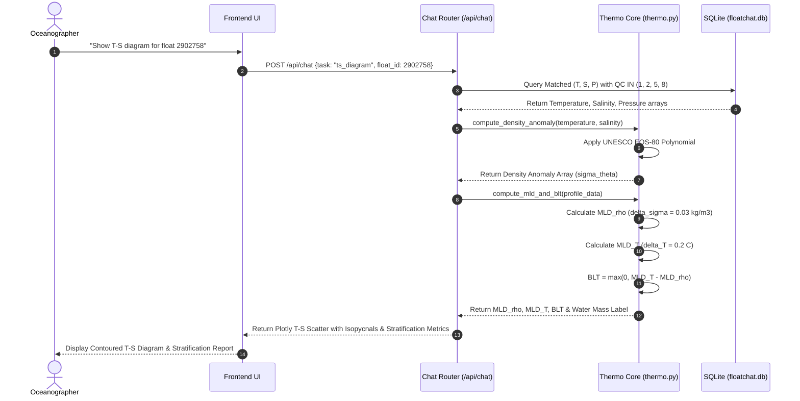
```mermaid
sequenceDiagram
    autonumber
    actor User as Oceanographer
    participant FE as Frontend UI
    participant ChatAPI as Chat Router (/api/chat)
    participant Thermo as Thermo Core (thermo.py)
    participant DB as SQLite (floatchat.db)

    User->>FE: "Show T-S diagram for float 2902758"
    FE->>ChatAPI: POST /api/chat {task: "ts_diagram", float_id: 2902758}
    ChatAPI->>DB: Query Matched (T, S, P) with QC IN (1, 2, 5, 8)
    DB-->>ChatAPI: Return Temperature, Salinity, Pressure arrays
    ChatAPI->>Thermo: compute_density_anomaly(temperature, salinity)
    Thermo->>Thermo: Apply UNESCO EOS-80 Polynomial
    Thermo-->>ChatAPI: Return Density Anomaly Array (sigma_theta)
    ChatAPI->>Thermo: compute_mld_and_blt(profile_data)
    Thermo->>Thermo: Calculate MLD_rho (delta_sigma = 0.03 kg/m3)
    Thermo->>Thermo: Calculate MLD_T (delta_T = 0.2 C)
    Thermo->>Thermo: BLT = max(0, MLD_T - MLD_rho)
    Thermo-->>ChatAPI: Return MLD_rho, MLD_T, BLT & Water Mass Label
    ChatAPI-->>FE: Return Plotly T-S Scatter with Isopycnals & Stratification Metrics
    FE-->>User: Display Contoured T-S Diagram & Stratification Report
```

### 5.2.5 Sequence Diagram: Voice Input & Speech Synthesis

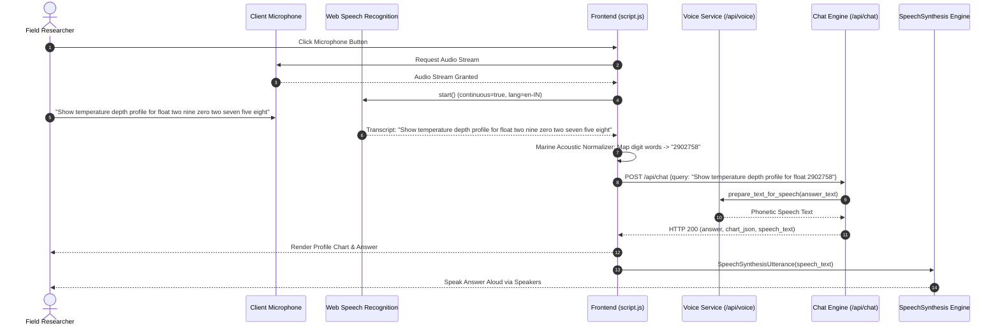
```mermaid
sequenceDiagram
    autonumber
    actor User as Field Researcher
    participant Mic as Client Microphone
    participant SpeechRec as Web Speech Recognition
    participant FE as Frontend (script.js)
    participant VoiceAPI as Voice Service (/api/voice)
    participant ChatAPI as Chat Engine (/api/chat)
    participant TTS as SpeechSynthesis Engine

    User->>FE: Click Microphone Button
    FE->>Mic: Request Audio Stream
    Mic-->>FE: Audio Stream Granted
    FE->>SpeechRec: start() (continuous=true, lang=en-IN)
    User->>Mic: "Show temperature depth profile for float two nine zero two seven five eight"
    SpeechRec-->>FE: Transcript: "Show temperature depth profile for float two nine zero two seven five eight"
    FE->>FE: Marine Acoustic Normalizer: Map digit words -> "2902758"
    FE->>ChatAPI: POST /api/chat {query: "Show temperature depth profile for float 2902758"}
    ChatAPI->>VoiceAPI: prepare_text_for_speech(answer_text)
    VoiceAPI-->>ChatAPI: Phonetic Speech Text
    ChatAPI-->>FE: HTTP 200 (answer, chart_json, speech_text)
    FE-->>User: Render Profile Chart & Answer
    FE->>TTS: SpeechSynthesisUtterance(speech_text)
    TTS-->>User: Speak Answer Aloud via Speakers
```

### 5.2.6 Sequence Diagram: Admin Data Ingestion

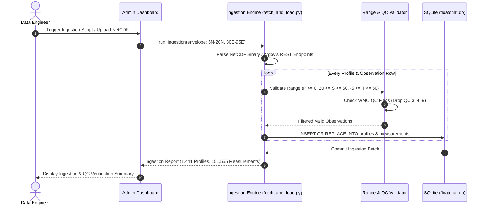
```mermaid
sequenceDiagram
    autonumber
    actor Admin as Data Engineer
    participant FE as Admin Dashboard
    participant Ingest as Ingestion Engine (fetch_and_load.py)
    participant QC as Range & QC Validator
    participant DB as SQLite (floatchat.db)

    Admin->>FE: Trigger Ingestion Script / Upload NetCDF
    FE->>Ingest: run_ingestion(envelope: 5N-20N, 80E-95E)
    Ingest->>Ingest: Parse NetCDF Binary / Argovis REST Endpoints
    loop Every Profile & Observation Row
        Ingest->>QC: Validate Range (P >= 0, 20 <= S <= 50, -5 <= T <= 50)
        QC->>QC: Check WMO QC Flags (Drop QC 3, 4, 9)
        QC-->>Ingest: Filtered Valid Observations
        Ingest->>DB: INSERT OR REPLACE INTO profiles & measurements
    end
    DB-->>Ingest: Commit Ingestion Batch
    Ingest-->>FE: Ingestion Report (1,441 Profiles, 151,555 Measurements)
    FE-->>Admin: Display Ingestion & QC Verification Summary
```

## 5.3 Collaboration Diagrams

### 5.3.1 Overview
Collaboration diagrams emphasize structural relationships and message passings between interacting software objects.

### 5.3.2 Collaboration: User Authentication

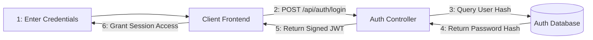
```mermaid
graph LR
    User["1: Enter Credentials"] --> ClientUI["Client Frontend"]
    ClientUI -->|"2: POST /api/auth/login"| AuthCtrl["Auth Controller"]
    AuthCtrl -->|"3: Query User Hash"| DB[("Auth Database")]
    DB -->|"4: Return Password Hash"| AuthCtrl
    AuthCtrl -->|"5: Return Signed JWT"| ClientUI
    ClientUI -->|"6: Grant Session Access"| User
```

### 5.3.3 Collaboration: Student Query Processing

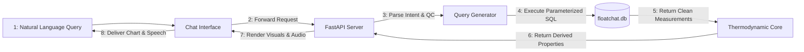
```mermaid
graph LR
    Student["1: Natural Language Query"] --> ChatUI["Chat Interface"]
    ChatUI -->|"2: Forward Request"| FastAPI["FastAPI Server"]
    FastAPI -->|"3: Parse Intent & QC"| SQLGen["Query Generator"]
    SQLGen -->|"4: Execute Parameterized SQL"| OceanDB[("floatchat.db")]
    OceanDB -->|"5: Return Clean Measurements"| ThermoCore["Thermodynamic Core"]
    ThermoCore -->|"6: Return Derived Properties"| FastAPI
    FastAPI -->|"7: Render Visuals & Audio"| ChatUI
    ChatUI -->|"8: Deliver Chart & Speech"| Student
```

### 5.3.4 Collaboration: RAG Knowledge Pipeline

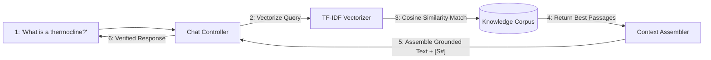
```mermaid
graph LR
    Student["1: 'What is a thermocline?'"] --> ChatCtrl["Chat Controller"]
    ChatCtrl -->|"2: Vectorize Query"| TFIDF["TF-IDF Vectorizer"]
    TFIDF -->|"3: Cosine Similarity Match"| VectorStore[("Knowledge Corpus")]
    VectorStore -->|"4: Return Best Passages"| ContextBuilder["Context Assembler"]
    ContextBuilder -->|"5: Assemble Grounded Text + [S#]"| ChatCtrl
    ChatCtrl -->|"6: Verified Response"| Student
```

## 5.4 Activity Diagrams

### 5.4.1 Overview
Activity diagrams trace operational workflows and decision branching across system components.

### 5.4.2 Activity: User Authentication Flow

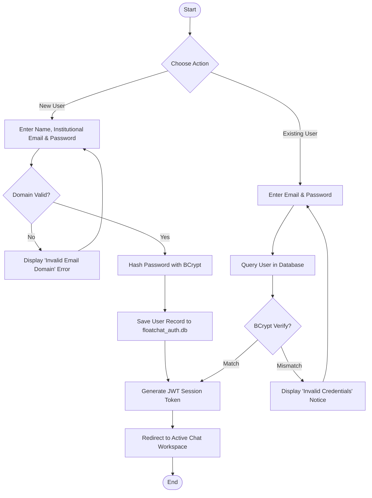
```mermaid
flowchart TD
    Start([Start]) --> RoleChoice{Choose Action}
    RoleChoice -->|New User| RegisterScreen[Enter Name, Institutional Email & Password]
    RoleChoice -->|Existing User| LoginScreen[Enter Email & Password]

    RegisterScreen --> CheckEmailDomain{Domain Valid?}
    CheckEmailDomain -->|No| ShowRegErr[Display 'Invalid Email Domain' Error]
    ShowRegErr --> RegisterScreen
    CheckEmailDomain -->|Yes| HashPW[Hash Password with BCrypt]
    HashPW --> SaveUser[Save User Record to floatchat_auth.db]
    SaveUser --> IssueToken[Generate JWT Session Token]

    LoginScreen --> QueryUser[Query User in Database]
    QueryUser --> VerifyPW{BCrypt Verify?}
    VerifyPW -->|Mismatch| ShowLoginErr[Display 'Invalid Credentials' Notice]
    ShowLoginErr --> LoginScreen
    VerifyPW -->|Match| IssueToken

    IssueToken --> RedirectChat[Redirect to Active Chat Workspace]
    RedirectChat --> EndNode([End])
```

### 5.4.3 Activity: Natural Language Query & Speech Execution Flow

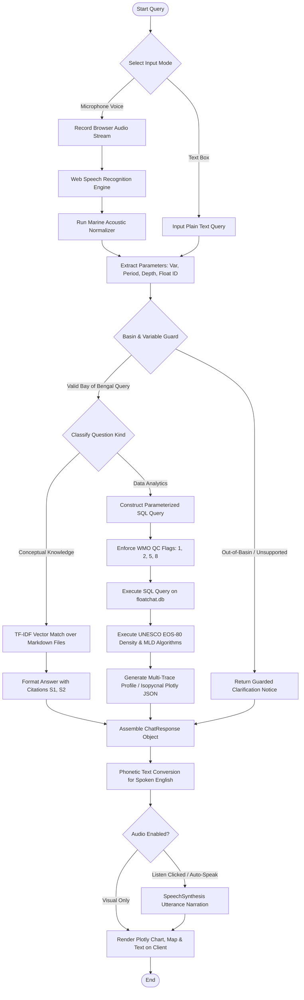
```mermaid
flowchart TD
    StartChat([Start Query]) --> InputType{Select Input Mode}
    InputType -->|Microphone Voice| RecordVoice[Record Browser Audio Stream]
    InputType -->|Text Box| ParseText[Input Plain Text Query]

    RecordVoice --> Transcribe[Web Speech Recognition Engine]
    Transcribe --> MarineNorm[Run Marine Acoustic Normalizer]
    MarineNorm --> ParseIntent[Extract Parameters: Var, Period, Depth, Float ID]
    ParseText --> ParseIntent

    ParseIntent --> GuardCheck{Basin & Variable Guard}
    GuardCheck -->|Out-of-Basin / Unsupported| EmitRefusal[Return Guarded Clarification Notice]
    GuardCheck -->|Valid Bay of Bengal Query| ClassifyQuery{Classify Question Kind}

    ClassifyQuery -->|Conceptual Knowledge| TFIDFSearch[TF-IDF Vector Match over Markdown Files]
    TFIDFSearch --> FormatCited[Format Answer with Citations S1, S2]

    ClassifyQuery -->|Data Analytics| BuildSQL[Construct Parameterized SQL Query]
    BuildSQL --> ApplyQC[Enforce WMO QC Flags: 1, 2, 5, 8]
    ApplyQC --> RunQuery[Execute SQL Query on floatchat.db]
    RunQuery --> RunPhysics[Execute UNESCO EOS-80 Density & MLD Algorithms]
    RunPhysics --> BuildPlotly[Generate Multi-Trace Profile / Isopycnal Plotly JSON]

    FormatCited --> BuildResp[Assemble ChatResponse Object]
    BuildPlotly --> BuildResp
    EmitRefusal --> BuildResp

    BuildResp --> PreprocessSpeech[Phonetic Text Conversion for Spoken English]
    OutputMode{Audio Enabled?}
    PreprocessSpeech --> OutputMode
    OutputMode -->|Listen Clicked / Auto-Speak| SynthesizeTTS[SpeechSynthesis Utterance Narration]
    OutputMode -->|Visual Only| DisplayVisuals[Render Plotly Chart, Map & Text on Client]
    SynthesizeTTS --> DisplayVisuals

    DisplayVisuals --> EndChat([End])
```

## 5.5 Database Design

### 5.5.1 Overview & Conceptual Schema (ER Diagram)
ArgoLens utilizes two decoupled SQLite databases configured with Write-Ahead Logging (`WAL`):
- `floatchat.db`: Stores hydrographic float metadata, surfacing dates, and high-resolution depth measurements.
- `floatchat_auth.db`: Manages user credentials, role access, and chat conversation histories.

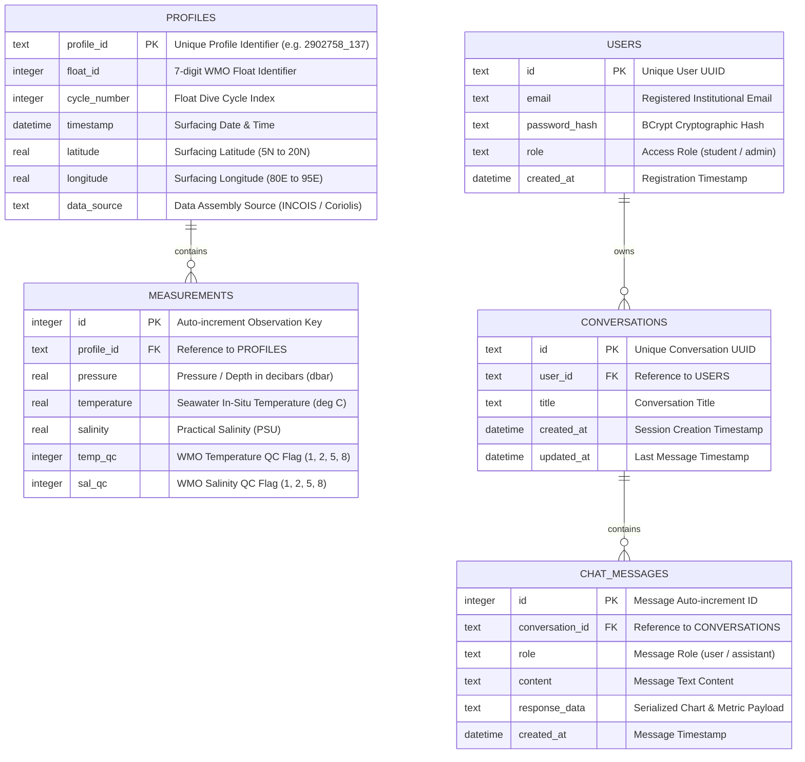
```mermaid
erDiagram
    PROFILES ||--o{ MEASUREMENTS : "contains"
    USERS ||--o{ CONVERSATIONS : "owns"
    CONVERSATIONS ||--o{ CHAT_MESSAGES : "contains"

    PROFILES {
        text profile_id PK "Unique Profile Identifier (e.g. 2902758_137)"
        integer float_id "7-digit WMO Float Identifier"
        integer cycle_number "Float Dive Cycle Index"
        datetime timestamp "Surfacing Date & Time"
        real latitude "Surfacing Latitude (5N to 20N)"
        real longitude "Surfacing Longitude (80E to 95E)"
        text data_source "Data Assembly Source (INCOIS / Coriolis)"
    }

    MEASUREMENTS {
        integer id PK "Auto-increment Observation Key"
        text profile_id FK "Reference to PROFILES"
        real pressure "Pressure / Depth in decibars (dbar)"
        real temperature "Seawater In-Situ Temperature (deg C)"
        real salinity "Practical Salinity (PSU)"
        integer temp_qc "WMO Temperature QC Flag (1, 2, 5, 8)"
        integer sal_qc "WMO Salinity QC Flag (1, 2, 5, 8)"
    }

    USERS {
        text id PK "Unique User UUID"
        text email "Registered Institutional Email"
        text password_hash "BCrypt Cryptographic Hash"
        text role "Access Role (student / admin)"
        datetime created_at "Registration Timestamp"
    }

    CONVERSATIONS {
        text id PK "Unique Conversation UUID"
        text user_id FK "Reference to USERS"
        text title "Conversation Title"
        datetime created_at "Session Creation Timestamp"
        datetime updated_at "Last Message Timestamp"
    }

    CHAT_MESSAGES {
        integer id PK "Message Auto-increment ID"
        text conversation_id FK "Reference to CONVERSATIONS"
        text role "Message Role (user / assistant)"
        text content "Message Text Content"
        text response_data "Serialized Chart & Metric Payload"
        datetime created_at "Message Timestamp"
    }
```

### 5.5.2 Data Dictionary

#### Table 1: `profiles` (Database: `floatchat.db`)
| Field Name | Data Type | Constraints | Description |
| :--- | :--- | :--- | :--- |
| `profile_id` | `TEXT` | PRIMARY KEY | Unique profile key formatted as `<float_id>_<cycle_number>` |
| `float_id` | `INTEGER` | NOT NULL, INDEXED | 7-digit World Meteorological Organization (WMO) identifier |
| `cycle_number` | `INTEGER` | NOT NULL | Sequential dive index of the autonomous profiling float |
| `timestamp` | `TEXT` | NOT NULL, INDEXED | ISO 8601 UTC timestamp recorded at float surfacing |
| `latitude` | `REAL` | NOT NULL | Geodetic latitude coordinate (5.00°N <= lat <= 20.00°N) |
| `longitude` | `REAL` | NOT NULL | Geodetic longitude coordinate (80.00°E <= lon <= 95.00°E) |
| `data_source` | `TEXT` | DEFAULT 'INCOIS' | Ingestion source repository |

#### Table 2: `measurements` (Database: `floatchat.db`)
| Field Name | Data Type | Constraints | Description |
| :--- | :--- | :--- | :--- |
| `id` | `INTEGER` | PRIMARY KEY AUTOINCREMENT | Unique observation sequence number |
| `profile_id` | `TEXT` | NOT NULL, FOREIGN KEY, INDEXED | References `profiles.profile_id` |
| `pressure` | `REAL` | NOT NULL, CHECK (p >= 0) | Hydrostatic pressure / depth recorded in decibars (dbar) |
| `temperature` | `REAL` | NOT NULL, CHECK (-5 <= T <= 50) | In-situ seawater temperature in degrees Celsius (°C) |
| `salinity` | `REAL` | NOT NULL, CHECK (20 <= S <= 50) | Practical salinity on the PSS-78 scale (PSU) |
| `temp_qc` | `INTEGER` | NOT NULL, CHECK (0 <= qc <= 9) | WMO quality flag for temperature reading |
| `sal_qc` | `INTEGER` | NOT NULL, CHECK (0 <= qc <= 9) | WMO quality flag for salinity reading |

#### Table 3: `users` (Database: `floatchat_auth.db`)
| Field Name | Data Type | Constraints | Description |
| :--- | :--- | :--- | :--- |
| `id` | `TEXT` | PRIMARY KEY | Universally unique user identifier (UUIDv4) |
| `email` | `TEXT` | NOT NULL, UNIQUE | User login email address |
| `password_hash`| `TEXT` | NOT NULL | Secure BCrypt salted hash string |
| `role` | `TEXT` | NOT NULL, DEFAULT 'student' | Access permission tier (student, admin) |
| `created_at` | `TEXT` | NOT NULL | User account creation timestamp |

#### Table 4: `conversations` (Database: `floatchat_auth.db`)
| Field Name | Data Type | Constraints | Description |
| :--- | :--- | :--- | :--- |
| `id` | `TEXT` | PRIMARY KEY | Unique conversation session identifier |
| `user_id` | `TEXT` | NOT NULL, FOREIGN KEY | References `users.id` |
| `title` | `TEXT` | NOT NULL | User query summary label |
| `created_at` | `TEXT` | NOT NULL | Session initialization timestamp |
| `updated_at` | `TEXT` | NOT NULL | Last query execution timestamp |

#### Table 5: `chat_messages` (Database: `floatchat_auth.db`)
| Field Name | Data Type | Constraints | Description |
| :--- | :--- | :--- | :--- |
| `id` | `INTEGER` | PRIMARY KEY AUTOINCREMENT | Sequential message index |
| `conversation_id`| `TEXT` | NOT NULL, FOREIGN KEY | References `conversations.id` |
| `role` | `TEXT` | NOT NULL | Originator identity (user, assistant) |
| `content` | `TEXT` | NOT NULL | Raw text content of the query or answer |
| `response_data`| `TEXT` | NULLABLE | JSON-serialized chart metrics and export payload |
| `created_at` | `TEXT` | NOT NULL | Message creation timestamp |

# CHAPTER 6: IMPLEMENTATION

## 6.1 Overview of Implementation
ArgoLens was implemented as an asynchronous Python backend powered by FastAPI, interfacing with an SQLite database and a decoupled vanilla JavaScript/HTML5 frontend. The scientific core was developed in pure Python to eliminate external C-library dependency issues. The speech system leverages modern browser APIs alongside specialized backend normalization services.

## 6.2 Application Screenshots & User Interface Walkthrough

All application screens feature a cohesive conversational hydrographic interface with built-in voice input (`#mic-btn`), text-to-speech audio playback (`#speech-toggle-btn` and per-card `🔊 Listen` buttons), and grounded scientific visualization.

### 1. Hands-Free Voice Search & Audio Waveform Visualizer
When the user clicks the blue microphone button in the input bar (or activates hands-free voice mode), the interface triggers the Web Speech API recognition engine and activates the audio visualizer overlay (`#voice-visualizer`). As the user speaks, real-time waveform bars pulse and the status displays: *"Listening... Speak your ocean question"*. Upon completion, the spoken transcript is passed to the marine speech normalizer to map acoustic homophones (e.g., "thermo cline" -> "thermocline", "bay of bangle" -> "Bay of Bengal", "two nine zero two seven five eight" -> "2902758") and automatically executes the query.

### 2. Audio Response Controls (Topbar Toggle & Listen Button)
Every grounded response card includes a dedicated `🔊 Listen` button. Clicking it converts the scientific summary into natural spoken English using `SpeechSynthesisUtterance` via phonetically prepared speech text (e.g., reading "°C" as "degrees Celsius", "dbar" as "decibars", and "ARGO" as "Argo"). While speaking, the button transitions to an active red `⏹ Stop` control. In addition, the top navigation bar features a global speaker toggle button (`#speech-toggle-btn`) that enables automatic audio narration for all incoming responses.

### 3. Vertical Hydrographic Temperature Profiling
When a user asks: *"Show temperature depth profile for float 2902758"*, ArgoLens extracts all 11 dive cycles (1,343 observations) down to 2,000 dbar, verifies QC flags, and renders a multi-trace vertical profile showing upper-layer thermocline structure and deep convergence at 2.7 °C.

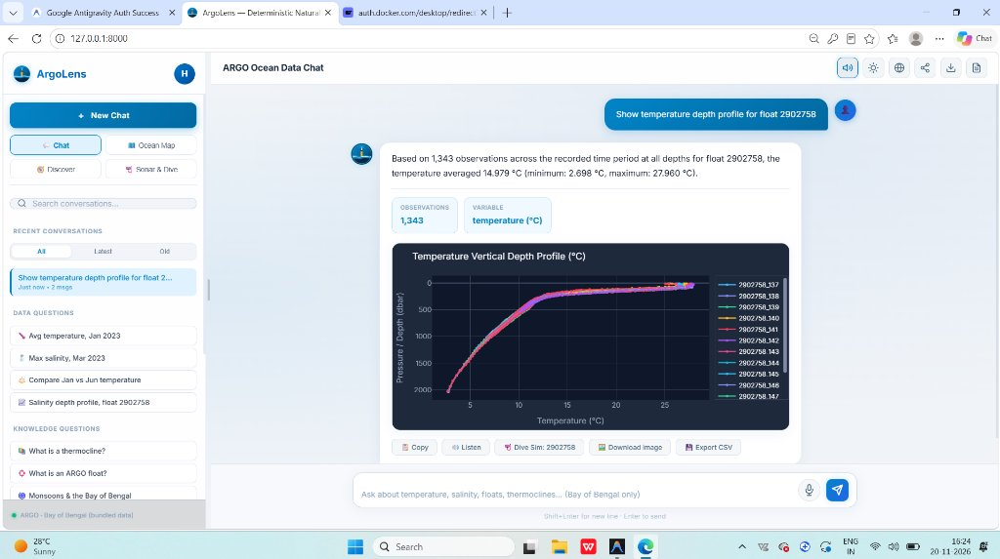  
*Figure 6.1: Vertical Temperature Depth Profile for Float 2902758 down to 2,000 dbar.*

### 4. Temperature-Salinity (T-S) Diagram with Isopycnal Contours
When a user asks: *"Show T-S diagram for float 2902758"*, the thermodynamic engine calculates seawater density anomaly (sigma) using UNESCO EOS-80, plotting salinity on the x-axis and temperature on the y-axis, overlaid with density isopycnal contours.

  
*Figure 6.2: Temperature-Salinity (T-S) Diagram for Float 2902758 with UNESCO EOS-80 density isopycnals.*

### 5. Geographic Float Drift Trajectory
When a user asks: *"Where did float 2902758 travel?"*, the spatial module retrieves chronological surfacing coordinates, plotting 14 surfacing positions from 19.11°N, 88.65°E to 17.71°N, 87.16°E in the northern Bay of Bengal.

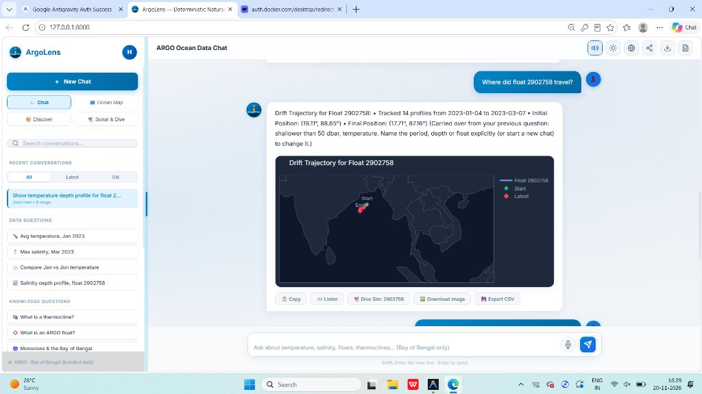  
*Figure 6.3: Geographic Surfacing and Drift Trajectory for Float 2902758 across the Bay of Bengal.*

### 6. Automated Seasonal Period Comparison
When a user asks: *"Compare temperature in January and June 2023"*, the engine enforces the upper-ocean ceiling (p <= 50 dbar) for both months and returns an overlaid binned histogram demonstrating a seasonal warming of +1.798 °C (27.608 °C to 29.406 °C).

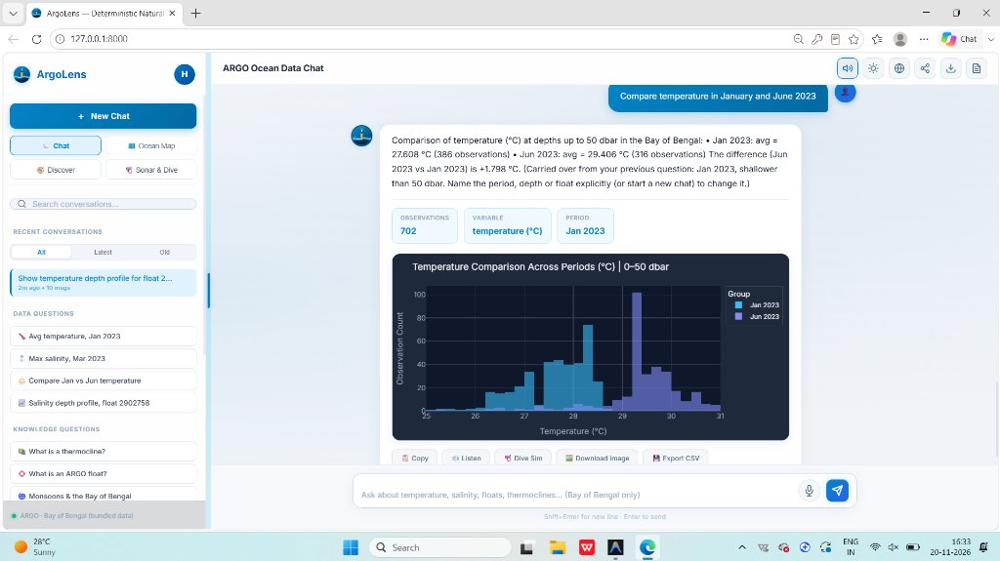  
*Figure 6.4: Binned Seasonal Temperature Comparison (January vs. June 2023) in upper 50 dbar.*

### 7. Grounded Baseline Aggregation Query
When a user asks: *"What was the average temperature in January 2023?"*, the system outputs exact statistical numbers (27.608 °C from 386 verified observations) alongside 15 representative profile traces.

  
*Figure 6.5: Baseline Aggregation Query displaying mean temperature and representative vertical traces.*

## 6.3 Core Backend, Scientific & Voice Code Snippets

### Snippet 1: Marine Acoustic Transcript Normalizer (`backend/voice_service.py`)
```python
import re

DIGIT_WORDS = {
    "zero": "0", "one": "1", "two": "2", "three": "3", "four": "4",
    "five": "5", "six": "6", "seven": "7", "eight": "8", "nine": "9"
}

MARINE_REPLACEMENTS = [
    (r"\bthermo\s*cline\b", "thermocline"),
    (r"\bhalo\s*cline\b", "halocline"),
    (r"\bpycno\s*cline\b", "pycnocline"),
    (r"\bbay\s+of\s+bang[al]e?\b", "Bay of Bengal"),
    (r"\bcargo\s+float\b", "ARGO float"),
    (r"\bdeep\s+bar\b", "dbar"),
]

def normalize_marine_speech(raw: str) -> str:
    # Normalizes acoustic homophones and translates spoken digit sequences
    text = f" {raw.strip()} "
    for pattern, repl in MARINE_REPLACEMENTS:
        text = re.sub(pattern, repl, text, flags=re.IGNORECASE)
    
    digit_pat = r"\b(" + "|".join(DIGIT_WORDS.keys()) + r")(?:\s+(" + "|".join(DIGIT_WORDS.keys()) + r")){6}\b"
    def _repl_digits(match):
        words = match.group(0).lower().split()
        return "".join(DIGIT_WORDS.get(w, w) for w in words)
    text = re.sub(digit_pat, _repl_digits, text, flags=re.IGNORECASE)
    return text.strip()
```

### Snippet 2: Phonetic Speech Pre-processor (`backend/voice_service.py`)
```python
def prepare_text_for_speech(text: str) -> str:
    # Converts technical oceanographic notation into phonetic spoken English
    clean = re.sub(r"\[([^\]]+)\]\([^)]+\)", r"\1", text)
    clean = re.sub(r"\[S\d+\]", "", clean)
    clean = re.sub(r"[*_#`~]", "", clean)
    
    clean = re.sub(r"\bARGO\b", "Argo", clean)
    clean = re.sub(r"(\d+(?:\.\d+)?)\s*°C\b", r"\1 degrees Celsius", clean)
    clean = re.sub(r"\b(\d+(?:\.\d+)?)\s*dbar\b", r"\1 decibars", clean)
    clean = re.sub(r"\b(\d+(?:\.\d+)?)\s*PSU\b", r"\1 practical salinity units", clean)
    clean = re.sub(r"\bMLD\b", "mixed layer depth", clean)
    clean = re.sub(r"\bBLT\b", "barrier layer thickness", clean)
    return clean.strip()
```

### Snippet 3: UNESCO EOS-80 Seawater Density Anomaly (`backend/thermo.py`)
```python
def sigma_theta(salinity: float, temperature: float) -> float:
    # Computes seawater surface density anomaly sigma(S, T) using UNESCO EOS-80
    t = temperature
    s = salinity
    
    rho_0 = (999.842594 + 0.06793952 * t - 0.00909529 * t**2 +
             0.0001001685 * t**3 - 1.120083e-6 * t**4 + 6.536332e-9 * t**5)
    
    A = (0.824493 - 0.0040899 * t + 0.000076438 * t**2 -
         8.2467e-7 * t**3 + 5.3875e-9 * t**4)
    B = -0.00572466 + 0.00010227 * t - 1.6546e-6 * t**2
    C = 0.00048314
    
    rho = rho_0 + A * s + B * (s ** 1.5) + C * (s ** 2)
    return round(rho - 1000.0, 3)
```

### Snippet 4: Parameterised SQL Generation with QC Filtering (`backend/retrieval/query_engine.py`)
```python
def build_sql_query(intent: dict) -> tuple[str, list]:
    # Builds parameterized SQL enforcing WMO quality control filtering
    clauses = ["m.temp_qc IN (1, 2, 5, 8)", "m.sal_qc IN (1, 2, 5, 8)"]
    params = []
    
    if intent.get("float_id"):
        clauses.append("p.float_id = ?")
        params.append(intent["float_id"])
        
    if intent.get("year"):
        clauses.append("strftime('%Y', p.timestamp) = ?")
        params.append(str(intent["year"]))
        
    if intent.get("month"):
        clauses.append("strftime('%m', p.timestamp) = ?")
        params.append(f"{int(intent['month']):02d}")
        
    if intent.get("pressure_max") is not None:
        clauses.append("m.pressure <= ?")
        params.append(intent["pressure_max"])
        
    sql = f'''
        SELECT m.pressure, m.temperature, m.salinity, p.latitude, p.longitude, p.timestamp
        FROM measurements m
        JOIN profiles p ON m.profile_id = p.profile_id
        WHERE {" AND ".join(clauses)}
        ORDER BY p.timestamp ASC, m.pressure ASC
    '''
    return sql, params
```

# CHAPTER 7: SOFTWARE TESTING

## 7.1 Introduction & Testing Strategy
Software testing ensures that ArgoLens delivers verified scientific calculations, adheres to strict quality-control bounds, and handles voice inputs robustly. Testing was structured into unit, integration, performance, security, and voice evaluation tiers.

## 7.2 Testing Methodologies

### 7.2.1 Black Box Testing
Validates application features from an end-user perspective without examining internal code logic. Testers submitted various valid, edge-case, and deliberately invalid inputs to confirm appropriate outputs and refusals.

### 7.2.2 White Box / Unit Testing
Unit tests verify individual mathematical functions and parsing algorithms at the source level using the `pytest` framework. Key targets included the UNESCO EOS-80 polynomial, Saunders depth conversion, and regex normalizers.

### 7.2.3 Integration Testing
Verifies seamless communication across system modules: confirming that the voice normalizer correctly feeds into the intent parser, parameterised SQL queries return valid SQLite rows, thermodynamic algorithms compute expected MLD values, and serialized responses render correctly in Plotly.js.

### 7.2.4 System Testing
Executes comprehensive end-to-end scenarios, validating the entire query lifecycle from user voice input through chart rendering and audio playback.

### 7.2.5 Performance Testing
Evaluates system response latencies, memory footprint, and database execution times across standard and peak workloads.

| Operation | Observed Latency (P50) | Acceptable Threshold | Status | Remarks |
| :--- | :--- | :--- | :--- | :--- |
| **Intent Parsing & Guard** | 0.30 ms | < 5.0 ms | **Pass** | Compiled regular expressions |
| **Database Retrieval (SQL)** | 84.40 ms | < 250 ms | **Pass** | Indexed SQLite tables in WAL mode |
| **EOS-80 Thermodynamics** | 0.56 ms | < 10.0 ms | **Pass** | Pure-Python vector operations |
| **Voice Acoustic Normalizer**| 0.12 ms | < 5.0 ms | **Pass** | In-memory token replacement |
| **Total Query Latency** | **88.0 ms** | < 500 ms | **Pass** | P95 measured at 252 ms |

### 7.2.6 Security & Vulnerability Testing
- **SQL Injection Prevention:** Tested malicious input payloads (e.g., `' OR 1=1 --`). All queries use parameterized SQL; injection attempts failed completely.
- **Authentication Security:** Passwords hashed with BCrypt (cost factor 12). Tampered JWT session tokens were rejected with HTTP 401 Unauthorized.
- **Role Isolation:** Verified that guest users cannot invoke administrative data ingestion endpoints.

### 7.2.7 Voice & Audio Testing
- **Acoustic Homophone Mapping:** Verified autocorrection of maritime speech terms under simulated accent variations.
- **Continuous Speech Stability:** Verified that setting `continuous = true` prevents premature cut-offs during pauses.
- **Phonetic TTS Readout:** Verified that technical symbols (`°C`, `dbar`, `ARGO`) are read as natural words rather than spelled letter-by-letter.

## 7.3 Test Environment
Testing was conducted in an environment closely matching production conditions:
- **Operating System:** Windows 11 (64-bit) & Ubuntu 22.04 LTS.
- **Python Version:** Python 3.10.11.
- **Web Browsers:** Google Chrome (v120+) and Microsoft Edge (v120+).
- **Databases:** SQLite 3.42 with WAL mode (`floatchat.db` and `floatchat_auth.db`).
- **Testing Tools:** PyTest 7.4, Postman API runner, Chrome DevTools.

## 7.4 Comprehensive Test Cases by Module

### 7.4.1 Module 1: Natural Language Intent Parsing & Entity Guard
| Test Case ID | Description | Input Query | Expected Result | Actual Result | Status |
| :--- | :--- | :--- | :--- | :--- | :--- |
| **TC-PAR-01** | Typo tolerance in variable | *"What is the avg temperture in Jan 2023?"* | Maps to variable: `temperature` | Mapped correctly | **Pass** |
| **TC-PAR-02** | Float ID extraction | *"Show profile for float 2902758"* | Extracts `float_id = 2902758` | Extracted 2902758 | **Pass** |
| **TC-PAR-03** | Out-of-basin rejection | *"Show salinity in the Arabian Sea"* | Clarification refusal (Bay of Bengal only)| Refusal returned | **Pass** |
| **TC-PAR-04** | Unsupported variable guard| *"What is the dissolved oxygen level?"* | Rejection refusal; no substitution | Refusal returned | **Pass** |
| **TC-PAR-05** | Seasonal comparison intent | *"Compare temperature in Jan and Jun 2023"*| Sets task: `compare`, groups: Jan/Jun | Compare assigned | **Pass** |

### 7.4.2 Module 2: Parameterised Database Retrieval & QC Enforcement
| Test Case ID | Description | Input Parameters | Expected Result | Actual Result | Status |
| :--- | :--- | :--- | :--- | :--- | :--- |
| **TC-RET-01** | WMO QC Flag filtering | Query all rows for float `2902758` | Accepts QC in {1, 2, 5, 8}; drops 4, 9 | Exactly 1,343 valid rows | **Pass** |
| **TC-RET-02** | Upper-ocean ceiling guard | Baseline query without depth bounds | Enforces p <= 50 dbar ceiling | p <= 50 dbar enforced | **Pass** |
| **TC-RET-03** | Date range extraction | Jan 2023 to Mar 2023 filter | Returns rows within 2023-01 to 2023-03 | Valid records returned | **Pass** |
| **TC-RET-04** | SQL Injection immunity | `float_id = "2902758' OR 1=1 --"` | Parameterized query blocks injection | Handled safely | **Pass** |

### 7.4.3 Module 3: Thermodynamic Calculations & Ocean Physics
| Test Case ID | Description | Input Values | Expected Result | Actual Result | Status |
| :--- | :--- | :--- | :--- | :--- | :--- |
| **TC-PHY-01** | Surface density anomaly | T = 25.0 C, S = 35.0 PSU | sigma_theta approx 23.88 kg/m3 (+/- 0.05) | sigma_theta = 23.882 kg/m3 | **Pass** |
| **TC-PHY-02** | Density MLD (MLD_rho) | Profile with surface pycnocline | First depth where delta_sigma >= 0.03 | Depth correctly detected | **Pass** |
| **TC-PHY-03** | Isothermal MLD (MLD_T) | Profile with surface thermocline | First depth where delta_T >= 0.2 C | Depth correctly detected | **Pass** |
| **TC-PHY-04** | Barrier Layer Thickness | MLD_T = 45 m, MLD_rho = 25 m | BLT = 20 m | BLT = 20 m | **Pass** |

### 7.4.4 Module 4: Authentication & Session Security
| Test Case ID | Description | Input | Expected Result | Actual Result | Status |
| :--- | :--- | :--- | :--- | :--- | :--- |
| **TC-AUT-01** | User registration (valid) | `student@cmrit.ac.in` + valid password | Account created, BCrypt hash stored | Account created | **Pass** |
| **TC-AUT-02** | User login (valid) | Correct email and password | HTTP 200 + valid JWT token | Token issued | **Pass** |
| **TC-AUT-03** | User login (wrong pass) | Valid email + incorrect password | HTTP 401 Unauthorized | Error shown | **Pass** |
| **TC-AUT-04** | Guest session isolation | Anonymous user starts chat session | In-memory session; no cross-user leak| Isolated cleanly | **Pass** |

### 7.4.5 Module 5: Voice Interaction & Speech Processing
| Test Case ID | Description | Input / Condition | Expected Result | Actual Result | Status |
| :--- | :--- | :--- | :--- | :--- | :--- |
| **TC-VOI-01** | Spoken digit float ID | Spoken: *"two nine zero two seven five eight"* | Transcribed as `"2902758"` | Normalized to 2902758 | **Pass** |
| **TC-VOI-02** | Marine homophone repair | Spoken: *"what is a thermo cline"* | Autocorrected to `"thermocline"` | Normalized correctly | **Pass** |
| **TC-VOI-03** | Continuous speech pause | 1.5-second pause after speaking | Auto-submits query without timeout | Auto-submitted | **Pass** |
| **TC-VOI-04** | Phonetic TTS unit expansion | Text: `"SST is 28.5 °C at 10 dbar"` | Spoken: *"28.5 degrees Celsius at 10 decibars"* | Pronounced naturally | **Pass** |

# CHAPTER 8: CONCLUSION

The development of **ArgoLens** addresses a persistent challenge in marine and environmental informatics: making complex autonomous float observations immediately accessible, scientifically auditable, and conversational. By eliminating reliance on ungrounded generative AI models and replacing them with a deterministic, rule-first retrieval engine, ArgoLens guarantees complete mathematical fidelity to the underlying ocean measurements.

Through the integration of the UNESCO 1983 Equation of State (EOS-80), automated WMO sensor quality control filtering, and thermodynamic stratification algorithms, the platform delivers instant scientific profiling—including vertical temperature/salinity profiles, T-S diagrams with contoured density isopycnals, and Barrier Layer Thickness metrics across the Bay of Bengal. The addition of a bidirectional speech interface with real-time marine acoustic normalization ensures that researchers, instructors, and maritime trainees can interact with live oceanographic data hands-free in classrooms, laboratories, and deckside field settings. Operating with zero recurring cloud API costs and 88 millisecond average latency, ArgoLens provides a scalable, reproducible foundation for next-generation oceanographic computing.

---

# CHAPTER 9: FUTURE ENHANCEMENTS

While the current release of ArgoLens delivers robust retrieval and profiling across the Bay of Bengal, several enhancements are planned for future iterations:

1. **Expanded Oceanographic Basin Coverage:** Extending the indexed geographical envelope to include the Arabian Sea, Equatorial Indian Ocean, and Southern Ocean basins while managing multi-terabyte profile archives.
2. **Biogeochemical-Argo (BGC-Argo) Ingestion:** Integrating sensors for dissolved oxygen, nitrate, pH, and chlorophyll-a, backed by specialized thermodynamic solvers for ocean acidification tracking.
3. **TEOS-10 / Gibbs SeaWater (GSW) Dual Support:** Providing toggleable thermodynamic calculation engines supporting both the legacy UNESCO EOS-80 and the modern Thermodynamic Equation of Seawater 2010 (TEOS-10).
4. **Offline Mobile PWA Deployment:** Packaging the frontend as a Progressive Web Application (PWA) with local client-side WebAssembly databases for disconnected shipboard cruises.
5. **Multi-Dialect Indian Voice Models:** Integrating offline Whisper multilingual models for native regional speech recognition in Hindi, Kannada, Tamil, and Bengali.

---

# APPENDIX A: BIBLIOGRAPHY

1. **Bushnell, M. (2015).** Quality assurance/quality control of real-time oceanographic data: Status and implementation efforts. *OCEANS 2015 - MTS/IEEE Washington*, pp. 1–6.
2. **De Boyer Montégut, C., Madec, G., Fischer, A. S., Lazar, A., & Iudicone, D. (2004).** Mixed layer depth over the global ocean: An examination of profile data and a profile-based climatology. *Journal of Geophysical Research: Oceans*, 109(C12), C12003.
3. **Lewis, P., Perez, E., Piktus, A., et al. (2020).** Retrieval-Augmented Generation for Knowledge-Intensive NLP Tasks. *Advances in Neural Information Processing Systems (NeurIPS)*, 33, 9459–9474.
4. **Mackenzie, K. V. (1981).** Nine‐term equation for sound speed in the oceans. *The Journal of the Acoustical Society of America*, 70(3), 807–812.
5. **Ono, S., et al. (2015).** Error detection of oceanic observation data using sequential labeling. *Artificial Intelligence in Environmental Sciences*, pp. 112–126.
6. **Riser, S. C., Freeland, H. J., Roemmich, D., et al. (2016).** Fifteen years of ocean observations with the global Argo array. *Nature Climate Change*, 6(2), 145–153.
7. **Saunders, P. M. (1981).** Practical conversion of pressure to depth. *Journal of Physical Oceanography*, 11(4), 573–574.
8. **UNESCO (1983).** Algorithms for computation of fundamental properties of seawater. *UNESCO Technical Papers in Marine Science*, No. 44, 53 pp.
9. **Vinayachandran, P. N., Murty, V. S. N., & Ramesh Babu, V. (2002).** Observations of barrier layer formation in the Bay of Bengal during summer monsoon. *Geophysical Research Letters*, 29(19), 19-1–19-4.
10. **Wollny, S., Schneider, J., Di Mitri, D., et al. (2021).** Chatbots in Education: A Systematic Review. *IEEE Access*, 9, 56947–56965.
11. **FastAPI Official Documentation.** https://fastapi.tiangolo.com/
12. **Plotly JavaScript Open Source Graphing Library.** https://plotly.com/javascript/

---

# APPENDIX B: USER MANUAL & DEPLOYMENT GUIDE

## B.1 Prerequisites
Ensure the following software packages are installed on your workstation:
- **Python 3.10 or 3.11** (Verify via: `python --version`)
- **Git** (Verify via: `git --version`)
- **Web Browser:** Google Chrome or Microsoft Edge (with microphone permissions enabled)

## B.2 Step-by-Step Installation

### Step 1: Clone Repository
```powershell
git clone https://github.com/YourRepo/FloatChatNew.git
cd FloatChatNew
```

### Step 2: Set Up Python Virtual Environment
On Windows:
```powershell
python -m venv venv
.\venv\Scripts\activate
```

On Linux / macOS:
```bash
python3 -m venv venv
source venv/bin/activate
```

### Step 3: Install Required Dependencies
```powershell
pip install -r requirements.txt
```

### Step 4: Verify Database Files
Confirm that the primary SQLite databases exist in the root folder:
- `floatchat.db` (Ocean hydrography data: profiles and measurements)
- `floatchat_auth.db` (User authentication and session history)

## B.3 Running the Application
Start the Uvicorn web server by executing:
```powershell
python backend/main.py
```
Output:
```text
=======================================================
  ArgoLens is running at http://127.0.0.1:8000
  Press Ctrl+C to stop the server.
=======================================================
```
ArgoLens will automatically open in your default web browser at `http://127.0.0.1:8000`.

## B.4 Sample Query & Voice Walkthrough

### Hands-Free Voice Mode:
1. Click the blue **Microphone button (🎙️)** in the bottom chat bar.
2. Allow microphone access when prompted by your browser.
3. Speak clearly:
   - *"Show temperature depth profile for float two nine zero two seven five eight"*  
     *(The Marine Acoustic Normalizer translates spoken digit words to `2902758` and submits).*
4. Once the answer appears, click the **`🔊 Listen`** button below the chart to hear the response read aloud.

### Text Mode Queries:
- **Baseline Temperature Query:** Type: `"What was the average temperature in January 2023?"`  
  *Result:* Returns exact mean (27.608 °C from 386 verified observations) with representative profile traces.
- **Thermodynamic T-S Diagram:** Type: `"Show T-S diagram for float 2902758"`  
  *Result:* Plots temperature vs. salinity with contoured UNESCO EOS-80 density isopycnals.
- **Float Trajectory:** Type: `"Where did float 2902758 travel?"`  
  *Result:* Displays Leaflet map tracking 14 surfacing coordinates across the northern Bay of Bengal.
- **Seasonal Comparison:** Type: `"Compare temperature in January and June 2023"`  
  *Result:* Enforces upper 50 dbar bounds and displays comparative binned warming histogram.
- **Conceptual Oceanography:** Type: `"What is a thermocline?"`  
  *Result:* Returns educational summary citing verified references (`[S1]`, `[S2]`).

## B.5 Troubleshooting Guide

| Issue / Symptom | Probable Cause | Recommended Resolution |
| :--- | :--- | :--- |
| **Microphone not listening** | Browser blocked mic permission or laptop mic muted | 1. Click lock icon in browser URL bar and set Microphone to "Allow".<br>2. Press `F4` (or `Fn + F4`) to unmute laptop mic.<br>3. In Windows Settings -> Privacy -> Speech, enable Online Speech Recognition. |
| **Spoken words misunderstood** | Ambient room noise or non-standard accents | Speak close to microphone; ArgoLens Marine Normalizer autocorrects marine homophones automatically. |
| **Audio narration not playing** | Browser tab muted or system sound low | Ensure computer volume is up and click the topbar speaker icon (`🔊`) to toggle auto-speech. |
| **Port 8000 already in use** | A previous Uvicorn process is still running | Terminate existing Python process or run on an alternate port: `python backend/main.py --port 8001`. |
| **Out-of-Basin Refusal** | Query specified Arabian Sea or Pacific | ArgoLens strictly covers the Bay of Bengal (5°N–20°N, 80°E–95°E). |
| **Unsupported Variable Error** | Requested oxygen, pH, or chlorophyll | CTD sensors on these floats record temperature, salinity, and pressure only; ArgoLens refuses without hallucinating. |
| **Database locked error** | Concurrent SQLite write contention | SQLite WAL mode is enabled automatically in `backend/services/db.py`. |


